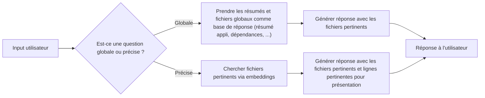

```mermaid
flowchart LR
Start[Input utilisateur] --> Analyse{Est-ce une question globale ou précise ?}
Analyse -->|Globale| Embeddings["Prendre les résumés et fichiers globaux comme base de réponse (résumé appli, dépendances, ...)"]
Analyse --> |Précise| Precise[Chercher fichiers pertinents via embeddings]
Embeddings --> GlobaleResponse[Générer réponse avec les fichiers pertinents]
Precise --> AugmentedResponse[Générer réponse avec les fichiers pertinents et lignes pertinentes pour présentation]
GlobaleResponse --> FinaleResponse[Réponse à l'utilisateur]
AugmentedResponse --> FinaleResponse
```

