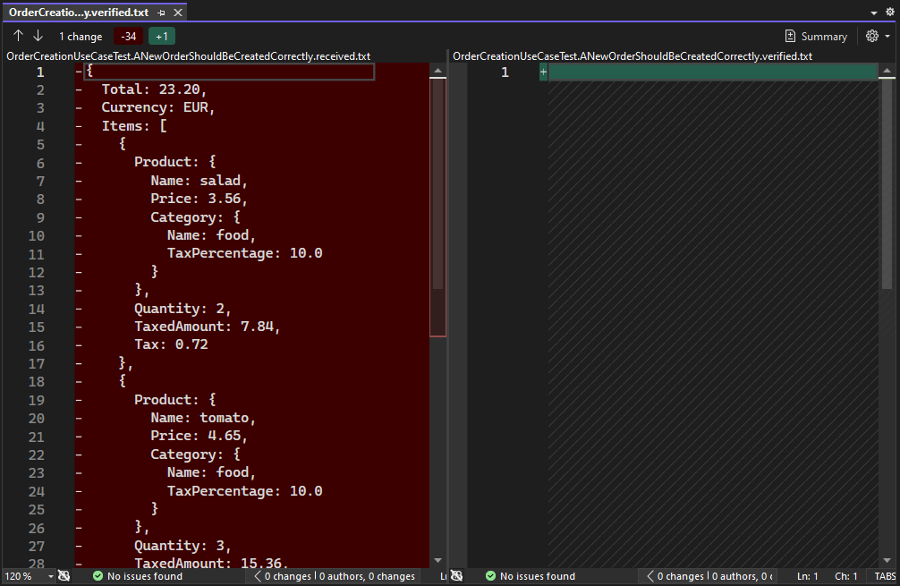
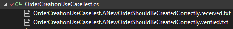

# Approval testing
*Temps de lecture:* **7 minutes**

Too Long; Didn't Read;
> L'approval testing, aussi connu sous le nom de snapshot testing,  est une technique permettant de simplifier l'écriture d'assertions complexes.

Il arrive fréquemment que l'on teste des objets ayant de nombreux champs, contenant des listes et d'autres sous-objets.
Ces tests donnent lieu à des assertions longues et complexes. On croise plusieurs stratégies pour gérer ces assertions, que l'on va passer en revue, avant de voir une technique permettant d'obtenir des vérifications approfondie et rapides à implémenter : l'approval testing.

*Note : les exemples de code sont en C#, mais la logique n'est pas liée à un langage en particulier. Elle peut être appliquée en Java, JS/TS, Python, ...*

## Scénario de test
Prenons l'exemple d'un test pour vérifier la création d'une commande contenant deux produits (provenant du très bon [Tell don't ask kata](https://github.com/racingDeveloper/tell-dont-ask-kata/tree/master/java/src/main/java/it/gabrieletondi/telldontaskkata)):

On créer une demande de création de commande (sellItemsRequest) contenant des items, chacun composé du nom d'un produit et de la quantité commandée.
On devra obtenir une commande (createdOrder) à l'état créée, avec tout un tas d'informations (prix total, tva, ...) correctement renseignées
```csharp
[Fact]
public void ANewOrderShouldBeCreatedCorrectly()
{
    // Arrange
    // on omet le setup de la base de données et autres configurations nécessaires
    var saladRequest = new SellItemRequest("salad", 2);
    var tomatoRequest = new SellItemRequest("tomato", 3);

    var request = new SellItemsRequest(new List<SellItemRequest> { saladRequest, tomatoRequest });

    // Act
    orderCreationHandler.Handle(request);
    Order createdOrder = _orderRepositoryFake.GetSavedOrder();
    
    // Assert
    ...
}
```

Voyons les assertions que l'on pourrait écrire pour ce test.

## Des bonnes assertions
### 1. Vérifier tous les champs
Bête et méchant, mais efficace. On vient vérifier l'ensemble des champs de l'order créé, ce qui permet de détecter une régression sur n'importe quelle valeur de la commande.
```csharp
Assert.Equal(OrderStatus.Created, createdOrder.Status);
Assert.Equal(23.20m, createdOrder.Total);
Assert.Equal(2.13m, createdOrder.Tax);
Assert.Equal("EUR", createdOrder.Currency);
Assert.Equal(2, createdOrder.Items.Count);
Assert.Equal("salad", createdOrder.Items[0].Product.Name);
Assert.Equal(3.56m, createdOrder.Items[0].Product.Price);
Assert.Equal(2, createdOrder.Items[0].Quantity);
Assert.Equal(7.84m, createdOrder.Items[0].TaxedAmount);
Assert.Equal(0.72m, createdOrder.Items[0].Tax);
Assert.Equal("tomato", createdOrder.Items[1].Product.Name);
Assert.Equal(4.65m, createdOrder.Items[1].Product.Price);
Assert.Equal(3, createdOrder.Items[1].Quantity);
Assert.Equal(15.36m, createdOrder.Items[1].TaxedAmount);
Assert.Equal(1.41m, createdOrder.Items[1].Tax);
```

#### Limites
Bien qu'efficace, cette approche est verbeuse. Si l'on doit souvent asserter des objets similaires, on peut vite être tenté de centraliser les assertions et de tester les mêmes valeurs en boucles (ici les mêmes produits, avec les mêmes prix, même quantités, …). Comme vu en parlant du [edge testing](http://tfs:8080/tfs/DefaultCollection/craftmanship/_git/coms-craft?path=%2Fedge-testing%2Fedge-testing.md&_a=preview), cela réduit le nombre de possibilités testées et limite l'efficacité des tests, c'est donc à éviter.

### 2. Construire un objet de référence
Pour réduire la longueur des assertions, certain créer un objet de référence, avec les valeurs attendues, puis compare l'objet obtenu après le test et l'objet de référence. 
La construction peut se faire avec un [object mother](https://deviq.com/design-patterns/object-mother-pattern), un [Test Data Builder](https://www.codecraftr.nl/p/maintainable-tests-with-test-data-builders) ou comme ici en lisant un fichier json plat. La comparaison peut être faite directement si le equal a déjà été surchargé, via une lib de comparaison profonde ou en passant par du json.
On le verra plus tard mais on se rapproche ici de l'idée de l'approval testing 🙂
```csharp
string referenceOrder = RessourceManager.GetJson("newOrderCreationReference");
Assert.Equal(referenceOrder, createdOrder);
```
#### Limites
Les mêmes que pour la méthode 1. Les erreurs des tests demandent également un peu plus d'analyse, elles n'indiquent plus clairement quel champ est problématique.

## Des assertions acceptables
### 3. Vérifier uniquement les champs pertinents pour notre scénario
L'idée est de se demander, pour chaque scénario de test, ce qui le différencie. Par exemple, on pourrait considérer que ce qui est important lors d'une création de commande, c'est son statut initial et que les informations globales soient bonnes. On peut se dire que les autres infos (comme les produits de la commande) seront vérifiées dans d'autres tests, plus pertinents pour ces champs.
Cette vision, pas forcément adaptée partout, a aussi le mérite de rendre le texte plus explicite, en mettant en valeur les champs importants.
```csharp
Assert.Equal(OrderStatus.Created, createdOrder.Status);
Assert.Equal(23.20m, createdOrder.Total);
Assert.Equal(2.13m, createdOrder.Tax);
Assert.Equal("EUR", createdOrder.Currency);
Assert.Equal(2, createdOrder.Items.Count);
```

#### Limites
Ce test détectera moins d'effet de bord à lui seul. Si on regardait le nombre de mutants que tue ce test, il serait moins élevé dans ce cas que pour les assertions 1 et 2. Il faut donc une bonne couverture globale de test pour reconstituer un bon niveau de sécurité, et de la rigueur pour s'assurer de ne pas laisser de trou important dans la couverture.


## Des mauvais assertions
### 4. Faire plaisir à Sonar / au code coverage
Cela se voit généralement lorsque l'on cherche à couper les angles tout en respectant un taux de coverage obligatoire. Une assertion valide suffira à faire passer le test en vert et marquera donc tout le code exécuté comme couvert, sans pour autant que le test soit utile.
Le mutation testing permet de rapidement détecter les bases utilisant ce genre de tests, car les survivants sont très nombreux, les tests ne détectant aucun mutant (ou très peu).
```csharp
Assert.NotNull(createdOrder);
// ou encore
Assert.True(true);
// les deux apportent le même niveau de sécurité --> aucune sécurité
```
### 5.ExcludeFromCodeCoverage
Ici on supprime carrément le test et exclu Order du calcul du coverage. Comme précédemment, on ne tire rien niveau sécurisation des développement / détection de régression.
Cette solution est néanmoins préférable à la solution 4. Elle a au moins le mérite d'être honnête en ne laissant pas croire que des tests sécurisent le code.


## Faire mieux et/ou plus simple: L'Approval testing
L'idée de l'approval testing est de se baser sur une version "approuvée" de l'entité (objet métier, string, structure html, http response, ...) que l'on souhaite vérifier.
Contrairement à la solution 2, c'est ici la lib d'approval testing qui va s'occuper de gérer la génération et la comparaison avec une version de référence, simplifiant grandement ce processus, tout en vérifiant l'intégralité de l'objet.
Cette simplicité permet de rendre plus simple la variation des jeux de données, car cela n'implique pas plus de travail (cf limites de la solution 1)

Il existe de l'outillage dans de nombreux langages, vous pouvez les retrouvez sur le site [approval tests](https://approvaltests.com/)

Nous allons ici illustrer le fonctionnement de l'approval testing à l'aide de [Verify](https://github.com/VerifyTests/Verify), une lib d'approval testing en c#

### Création du test
En reprenant notre test, nous pouvons grandement simplifier l'assertion. Il suffit de retourner l'appel au Verifier:
```csharp
[Fact]
public Task ANewOrderShouldBeCreatedCorrectly()
{
    // Arrange
    // on omet le setup de la base de données et autres configurations nécessaires
    var saladRequest = new SellItemRequest("salad", 2);
    var tomatoRequest = new SellItemRequest("tomato", 3);

    var request = new SellItemsRequest(new List<SellItemRequest> { saladRequest, tomatoRequest });

    // Act
    orderCreationHandler.Handle(request);
    Order createdOrder = _orderRepositoryFake.GetSavedOrder();
    
    // Assert
    return Verifier.Verify(createdOrder);
}
```

C'est aussi simple que ça. Si besoin, vous trouverez plus de détail dans la [documentation interne](https://confluence.cdiscount.com/display/COACHCRAFT/Approval+testing).
Le premier lancement du test va nous ouvrir notre diff par défaut (n'hésitez pas à [changer vos paramétres](https://github.com/VerifyTests/DiffEngine/blob/main/docs/diff-tool.order.md#custom-order) si ce n'est pas la bonne application qui s'ouvre) pour comparer les deux fichiers: le fichier générer par ce test (fichier .received), et la version approuvée (fichier .verified).



Comme le test n'a jamais été lancé, le fichier approuvé est vide. Il suffit de relire le contenu du fichier received. S’il est valide, il faut alors copier/coller son contenu dans le fichier verified - et sinon fixer le code ou le test -.
Une fois la version approuvée sauvegardée, le test passera, car les deux fichiers ont un contenu identique.

Les fichiers apparaissent alors sous le test dans VS. Il convient d'ajouter au versionning les .verified et d'ignorer les .received.



### Détection de regression
Imaginons maintenant que l'on introduise une régression lors d'un nouveau développement.
Le résultat de l'exécution du test risque alors d'être différent. Dans ce cas, le test tombe en erreur, le diff s'ouvre et nous montre les valeurs problématiques, ce qui évite une analyse complémentaire comme dans la solution 2.


### Mise à jour du test
Lorsqu'une fonctionnalité change, il est normal que certaines attentes doivent changer aussi, et donc d'adapter le test.
Dans ce cas, il faut de nouveau lancer le test qui cassera, **relire attentivement le .received** (clin d'œil aux adeptes du [-u de jest](https://medium.com/soluto-engineering/why-jest-snapshots-can-be-harmful-practical-examples-d469e6f65cd2), et si les changements sont bien ceux attendus, alors mettre à jour le .verified.

### Limites
On dépasse normalement les limites de la solution 1 (car c'est peu couteux à écrire) et également le problème de l'analyse du 2 grâce à l'usage du diff. Seul reste le fait que les valeurs attendues ne sont pas directement dans le test. Ce fonctionnement génére également de nombreux fichiers, mais ils sont normalement correctement cachés par les IDE.

Je ne m'étends pas plus. J'espère que ces outils vous permettront de faire des assertions précises plus rapidement. Et pourquoi remplacer les assert not lull qui traineraient seuls dans votre code 😁