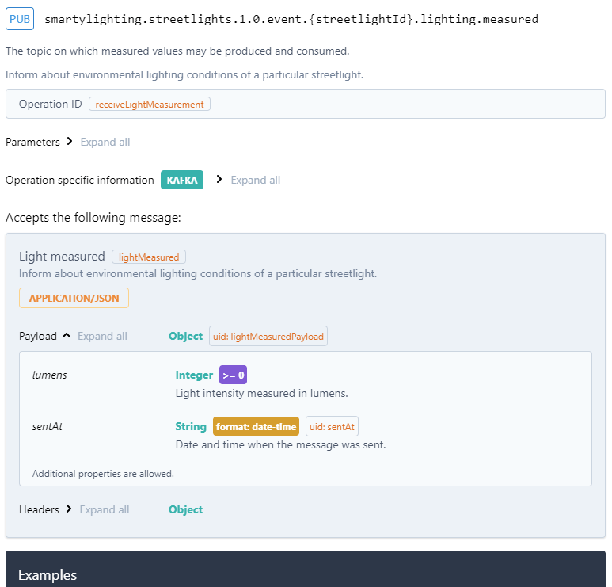
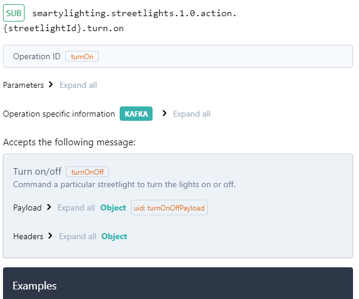

# AsyncAPI
*Temps de lecture* **2 minutes**

Too Long; Didn't Read;
> [AsyncAPI](https://www.asyncapi.com/) permet de documenter des contrats event-driven (ex: messaging via kafka) dans le même style que l'[OpenAPI](https://learn.openapis.org/) décrit les d'API web

Maintenant qu'une bonne partie de vos API sont correctement documentées et centralisée dans l'API management, vous vous dites peut être que ce serait pratique d'avoir la même chose pour l'ensemble des méthodes d'interaction entre vos différents composants, et pas uniquement pour le HTTP.

Ça tombe bien, pour ceux qui ne le savent pas encore, sachez qu'à l'instar d'OpenAPI, il existe un standard pour décrire des contrats event-driven (chez CDiscount, c'est typiquement tout ce qui passe par Kafka), à savoir [AsyncAPI](https://www.asyncapi.com/).
 
Ce formalisme vous permet de décrire les topics sur lesquels votre API publie (pub)

 
Et idem pour les messages consommés (sub), avec le détail des formats des messages, des infos d'authent, etc...

 
Un exemple complet est disponible dans le [studio AsyncAPI](https://studio.asyncapi.com/).

Niveau tooling, ce n'est pas encore au niveau de ce qui est proposé sur l'écosystème OpenAPI/Swagger, mais on a déjà des choses, notamment:
* [Le studio](https://studio.asyncapi.com/) pour l'édition donc
* De la génération de code à partir d'une spec, que ce soit des applications avec [le code complet](https://github.com/asyncapi/generator#list-of-official-generator-templates) pour publier/consommer, ou juste [les DTO](https://modelina.org/) liés au contrat
* Le support du format sur pas mal de solution d'API management

Et coup de chance, si vous souhaitez publier vos propres contrat AynscAPI, l'apim interne le supporte et la procédure de publication est [déjà documentée sur confluence](https://confluence.cdiscount.com/pages/viewpage.action?pageId=289959785#Miseenoeuvredesoutillagesdesp%C3%A9cifications-specs_publishPipelinepublicationdesp%C3%A9cification(s):~:text=suivantes%20sera%20ignor%C3%A9%3A-,AsyncAPI,-%3A).
 
J'espère que ce message aidera certaines équipes à mieux partager leurs contrats d'interface, et je vous souhaite à tous une bonne journée et un bon week-end ! 😁