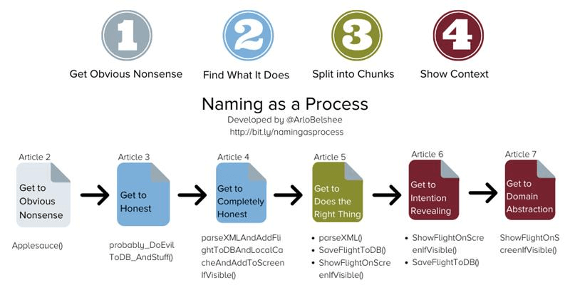
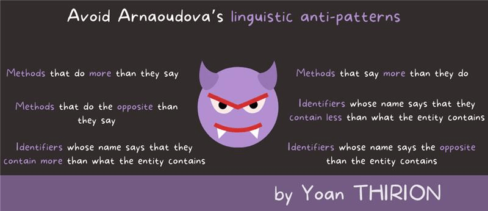

# Clean code naming
*Temps de lecture* **5 minutes**

Too Long; Didn't Read;
> Le naming correct des composants du code (méthodes, attributs, classes, paquets, ...) est l'élément le plus important à mettre en œuvre pour avoir un code propre et maintenable.
> Naming as a Process vous propose une façon d'améliorer le nommage dans du code existant via une série d'articles détaillés.
>
> 
 
Aujourd'hui, petit mot sur le clean code, et sur son pilier le plus important, le nommage.
Donner un nom à une méthode ou une classe est une action extrêmement fréquente et qui impacte la base de code sur le long terme.
 
Une simple méthode ayant un nom clair évitera la lecture de la dizaine de lignes de cette méthode à beaucoup de développeurs, au fil du temps,.
Un code avec des noms ne décrivant pas bien leur comportement ou un nommage trop orienté technique demandera plus de travail pour rentrer dedans et le modifier. C'est une des principales sources de [complexité accidentelle](https://www.lilobase.me/certaines-complexites-sont-plus-utiles-que-dautres/).
 
 
[A Philosophy of Software Design - John Ousterhout](https://nicolasbarlogis.github.io/snapreads/infographics/a-philosophy-of-software-design/#infographic)
 
 
Pire que des noms peu inspirés, il existe un certain nombre d'[anti-patterns linguistiques](https://www.linguistic-antipatterns.com/?tab=%22Confusable-methods%22).
 
Pourquoi pire ? Un nom peu clair ou générique poussera un développeur à lire le code pour connaître le vrai comportement du composant.
Au contraire, un nom qui a l'air précis, mais ne représente pas vraiment la réalité poussera probablement un dév à avoir confiance dans ce nom et utiliser par exemple la méthode, puis obtenir un comportement qui n'est pas celui attendu.
 
Au mieux, ce gap sera détecté avec un TU, au pire en production.

 
[The programmer's brain - Felienne Hermans](https://yoan-thirion.gitbook.io/knowledge-base/xtrem-reading/my-book-infographics)

À partir de ce constat, comment faire pour nommer correctement méthodes et variables dans le code ?

Nommer les méthodes en décrivant l'ensemble de leurs actions est une bonne première étape. Cela peut impliquer de mettre des And quand elles ont plusieurs responsabilités (ça permet aussi d'indiquer une bonne [opportunité de refacto](https://blog.cleancoder.com/uncle-bob/2014/05/08/SingleReponsibilityPrinciple.html)). Robert Matin donne également de bonnes pistes dans son livre Clean Code.

L'idéal étant probablement de se diriger vers du [code auto-documenté]}(https://kislayverma.com/programming/how-to-write-self-documenting-code/), souvent mieux réalisé en usant des principes du DDD tels que l'utilisation d'un [ubiquitous language](https://thedomaindrivendesign.io/developing-the-ubiquitous-language/) et l'application du principe d'[intention revealing interface](https://khalilstemmler.com/articles/typescript-domain-driven-design/intention-revealing-interfaces/) du [supple design](https://herbertograca.com/2015/12/07/ddd-10-supple-design/)

Pour ce qui est de la refacto, une des premières actions est généralement le [refactoring de surface](https://wiki.c2.com/?SurfaceRefactoring), renommer et extraire des méthodes/classes pour simplifier la lecture et donner du sens métier.
Arlo Belshee propose un processus étape par étape pour vous guider dans ce genre de refacto: le [naming as a process](https://www.digdeeproots.com/articles/on/naming-process/).

 
## Première étape
Accepter le fait que le nommage n'est pas bon. Si l'on sait ce que fait/représente réellement le composant, on peut directement passer à l'étape deux. Sinon, renommer avec un nom évidemment non représentatif permet au moins d'éviter le piège des anti-patterns linguistique et force les dévs suivants à ne pas faire confiance au nom.
Il est possible d'ajouter un préfixe défini à tous ces noms faux, pour flagger les besoins de renommage et faciliter les futures refacto

## Deuxième étape
Décrire fidèlement ce que fait la fonction/ce que représente la classe/variable. On réduit la complexité en évitant aux relecteurs suivant d'avoir à faire l'analyse pour savoir ce qui se cache réellement derrière ce nom. Même un nommage technique est ok ce stade.

## Troisième étape
On entre dans la vrai refacto, assurez vous d'avoir des tests auto pour vous assurer de ne rien casser !
Si le composant est trop gros (And dans le nom de la méthode, classe trop longue, ...), le splitter pour simplifier le comportement et les responsabilités

## Quatrième étape
Introduire du sens métier. Comme dit plus tôt, on applique les idées issues du DDD pour expliquer ce que fais la méthode / la classe fonctionnellement plutôt que comment elle le fait techniquement. Cela augmente l'expressivité du code, facilite les évolutions fonctionnelles et évite de lier les [concerns techniques et métier](https://medium.com/ssense-tech/domain-driven-design-everything-you-always-wanted-to-know-about-it-but-were-afraid-to-ask-a85e7b74497a#:~:text=Isolating%20the%20Domain%20from%20Other%20Concerns).

Avec tout ça, j'espère voir moins de méthodes juste nommées handle ou update dans les bases de code 😁