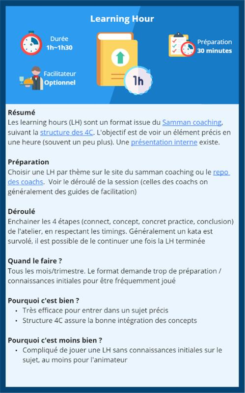

# Animation veille technique
*Temps de lecture*: 6 minutes (pdf inclu)

Too Long; Didn't Read;
> La veille technique c'est bien. La veille technique en groupe c'est encore mieux. Voilà dix formats pour animer des ateliers en groupe, avec votre équipe ou d'autres collègues. 
 
Aujourd'hui je fais suite au [post de Julien Vitte sur les learning hours](../learning-hours), je vous propose d'autres formats que vous pouvez utiliser pour animer vos ateliers veilles.
 
On a fait l'effort de synthétiser ces différentes options graphiquement, je vous laisse les découvrir et les utiliser pour vos session d'équipes:
* Sur miro [https://miro.com/app/board/uXjVNV8LaQs=/?share_link_id=742938669@](https://miro.com/app/board/uXjVNV8LaQs=/?share_link_id=742938669)
* Et en pdf [ateliers-craft.pdf](./ateliers-craft.pdf)
 
Un aperçu de ce à quoi ça ressemble:

 
Je sais très bien que c'est compliqué de se lancer dans son équipe sur des ateliers de veille / pratique, mais les bénéficies sont énormes. N'hésitez pas à nous poser des questions à Julien Vitte et moi-même pour vous aider à mettre le pied à l'étrier.

Pro tip: n'hésitez pas à demander de l'aide à votre team lead pour l'animation, ce sont des pros 
 
Un format vous plait plus que les autres ? 😁