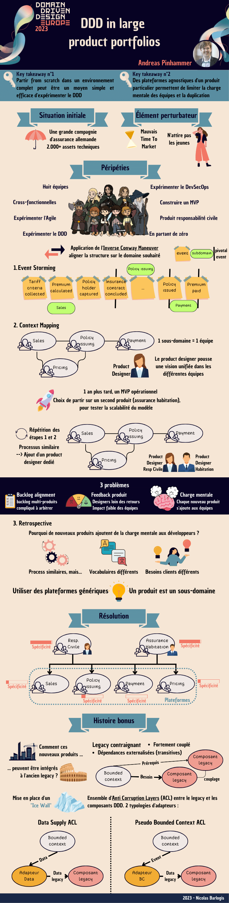
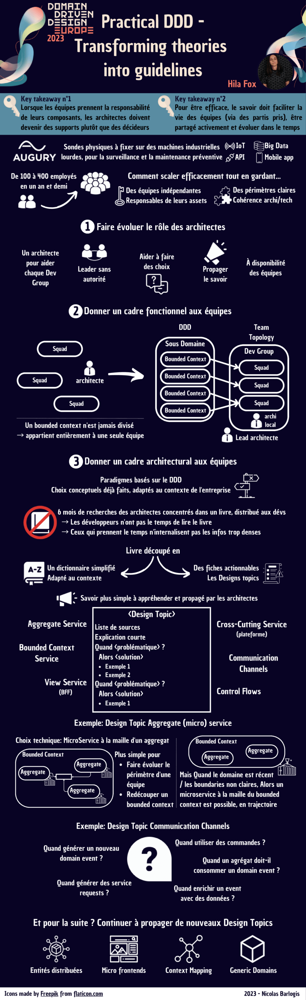
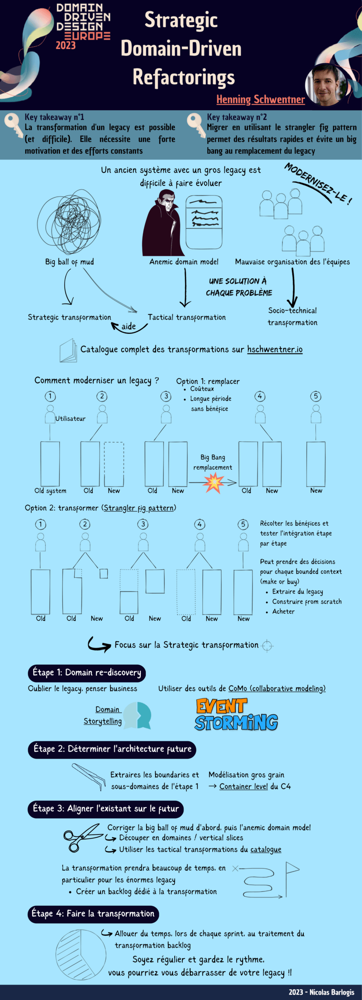

# DDD Europe 2023
*Temps de lecture* **12 minutes**

Too Long; Didn't Read;
> Compillation de 3 conférences qui ont été données lors du [DDD Europe 2023](https://2023.dddeurope.com/program/):
> * DDD in large product portfolio - Andreas Pinhammer
> * Practical DDD - Transforming theories into guidelines - Hila Fox
> * Strategic Domain-Driven Refactorings - Henning Schwentner

La semaine dernière j'ai eu la chance de participer au DDD Europe, où j'ai pu suivre une douzaine de talks plus qu'intéressants. J'ai décidé d'en résumer 3 sous forme graphique, et j'en profite pour vous les partager 🙂

## DDD in large product portfolio
La première conférence est un REX sur une expérimentation du DDD chez l'assureur Munich Re.
Ils ont choisi de tenter l'aventure en construisant du neuf à côté du legacy. Un bon enseignement de ce REX est probablement l'illustration de la différence entre un sous-domaine et un bounded context. Ils ont eu des soucis en mélangeant plusieurs bounded context d'un même sous domaine dans un seul composant.

Exemple: Le sous-domaine vente n'utilise pas du tout le même vocabulaire ni ne vise les mêmes personnes et objectifs selon qu'on parle de vente d'assurance habitation/mobilier ou de responsabilité civile 😅

PDF disponible [ici](https://nicolasbarlogis.github.io/snapreads/infographics/ddd-in-large-product-portfolio/)

## Practical DDD - Transforming theories into guidelines
La seconde conférence est aussi un REX. C'est un exemple intéressant de comment une équipe d'architectes a réussi à pousser du DDD dans leurs équipes, en simplifiant les connaissances nécessaires aux dévs pour le pratiquer tout en garantissant au maximum la cohérence globale des softs, via des choix par défaut sur certains aspects. 

On notera également les expérimentations sur la bonne façon de partager et rendre accessible la connaissance (via des fiches thématiques), et le rôle des architectes dans l'accompagnement des équipes via une orientation plus servant-leader (après pas de révolution totale non plus, ils continuent à faire des comités d'architecture, je vous rassure)

PDF disponible [ici](https://nicolasbarlogis.github.io/snapreads/infographics/practical-ddd-transforming-theories-into-guidelines/)

## Strategic Domain-Driven Refactorings
Et pour finir, je vous présente une initiative très intéressante de Henning Schwentner, le créateur du [Domain Storytelling](https://domainstorytelling.org/) (grosso-modo un équivalent de l'[event storming](https://www.eventstorming.com/)).

Le Domain-Driven Refactoring a pour but d'être un [catalogue de techniques](https://hschwentner.io/domain-driven-refactorings/) pour refactorer des anti-patterns DDD, dans la même veine que les [techniques](https://refactoring.guru/fr/refactoring/techniques) issues du livre [Refactoring](https://martinfowler.com/books/refactoring.html) de Martin Fowler.

C'est un WiP pour l'instant, toutes les techniques ne sont pas décrites et il en manque certaine, mais on a déjà globalement l'idée de ces stratégies. Elles sont réparties en 4 catégories:
* **Strategic**: pour les gros mouvements (niveau [stratégique](https://thedomaindrivendesign.io/what-is-strategic-design/)) comme splitter un asset mélangeant plusieurs bounded context ou mettre en place un [shared kernel](https://github.com/ddd-crew/context-mapping#shared-kernel) entre deux context existants
* **Socio-technical**: pour tout ce qui a trait au mouvement au sein des équipes technique, point souvent négligé lors des changements drivés par une évolution d'architecture
* **Tactical (against model anemia)**: refacto permettant de lutter contre un domain et des modèles anémiques. L'objectif est de remettre la logique concernant les modèles dans lesdits modèles
* **Tactical (against big ball of mud)**: pour démêler des god class et du code spaghetti.

Dans cette présentation, Henning présente les différentes étapes de mise en œuvre de ces différentes méthodes dans le cadre de la refacto d'un monolithe.

PDF disponible [ici](https://nicolasbarlogis.github.io/snapreads/infographics/strategic-domain-driven-refactorings/)