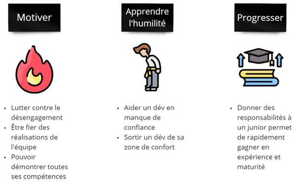
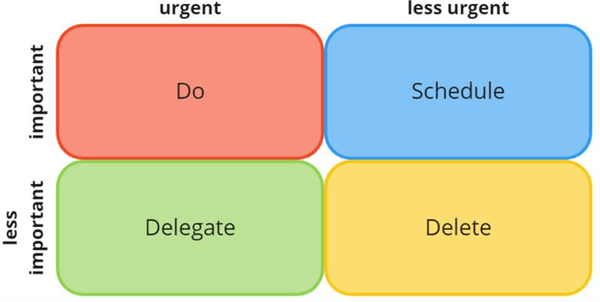
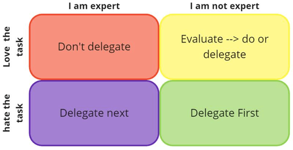
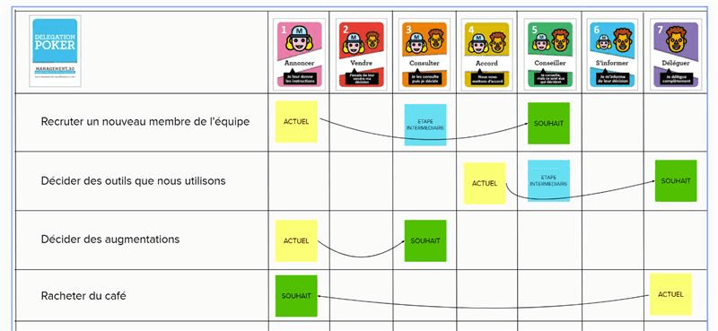

# Délégation
*Temps de lecture* **4 minutes**

Too Long; Didn't Read;
> Vous êtes Lead Dév (LD) ou Tech Lead (TL) ?
> Vous passez vos journées en réunion ?
> Vous avez l'impression de ne jamais pouvoir toucher à du code ?
> Vous ne vous engagez pas sur des tâches importantes, de peur de bloquer vos collègues ?
> Pas de soucis, nous avons la solution, la délégation !
 
Vous ne le savez peut-être pas, mais d'après [les fiches de poste Go2Product](https://confluence.cdiscount.com/pages/viewpage.action?pageId=190474106), un Lead dév est censé passer 70% de son temps à coder, et 50% pour un Tech Lead
 
 
 
## Pourquoi déléguer ?
Le but n'est pas uniquement de dégager du temps pour le LD/TL.
Donner des responsabilités aux membres de vos équipes peut les aider à progresser dans leurs compétences, rester motiver et prendre confiance dans leurs capacités et leur potentiel.
 
 
 
Évidement, il faut veiller à adapter tâche à la personne à qui on la confie.
Que ce soit en termes d'urgence, de complexité, et même d'appétence pour le sujet.
 
## Quelles tâches déléguer ?
Techniquement toutes les tâches sont délégables.
La première étape de lister les actions que vous réalisez.
 
Vous avez généralement des actions récurrentes (participer à un refinment, faire des reviews, prioriser le backlog tech, ...)
Et d'autres plus épisodiques (faire un poc d'un lib intéressante, préparer le com archi d'un nouvel asset, ...)
 
Vous pouvez prendre 2 à 4 semaines et noter systématiquement vos activités pour constituer une liste à peu près représentative de ce que vous faites généralement.
Vous pouvez ensuite passer à l'étape suivante pour savoir ce que vous souhaitez déléguer ou non.
 
## Faire ou déléguer ?
### Solo édition
Il existe de nombreuses matrices pour identifier, parmi vos tâches, lesquelles on le plus de valeur à traiter directement et lesquelles sont intéressantes à déléguer.
Une classique est la [matrice de délégation d'Eisenhower](https://www.eisenhower.me/eisenhower-matrix/)

 
En rangeant vos actions dans les différentes cases, vous aurez déjà une bonne base sur ce qui est important et ce qui l'est moins.
 
Mais il est possible de trier vos tâches selon d'autres critères, à vous de trouver ceux qui vous semblent les plus pertinents.
Par exemple, une autre matrice que je trouve intéressante vous permet typiquement de vous concentrer sur les activités que vous trouvez intéressante, tout en prenant en compte votre efficacité à les réaliser.
 
 
 
### Team édition
Même point de départ, en repartant de votre liste, il est possible en équipe (TL et LD ou LD et dévs) de voir quel niveau de délégation donner à chaque action, grâce au [delegation poker](https://coach-agile.com/2023/03/art-de-la-delegation-astuces-et-outils-pour-une-equipe-agile-performante/)

 
L'idée est, pour chacune des tâches, que chaque personne vote pour le niveau de délégation qu'il juge satisfaisant. Si les niveaux sont différents, on peut ensuite en discuter pour arriver à un compromis, exactement de la même façon que l'on fait l'estimation d'une tâche en planning poker.
Il est également intéressant de voir quel est le niveau actuel de délégation d'une tâche, en plus du niveau souhaité.
 
 
 
Une fois cette matrice remplie, on peut lister les éventuelles actions à mettre en œuvre pour atteindre le niveau de délégation souhaité.
 
Ensuite, il ne vous reste plus qu'à profiter de votre temps fraîchement libéré pour développer à nouveau😁
 
Contactez votre Team Lead ou Coach Agile le plus proche pour vous aider à faire un delegation poker dès maintenant !
 
Alors, vous voyez déjà quelles tâches déléguer ?
Ou alors vous faites partie des rares Lead dév / Tech Lead à ne pas manquer de temps ? 😲