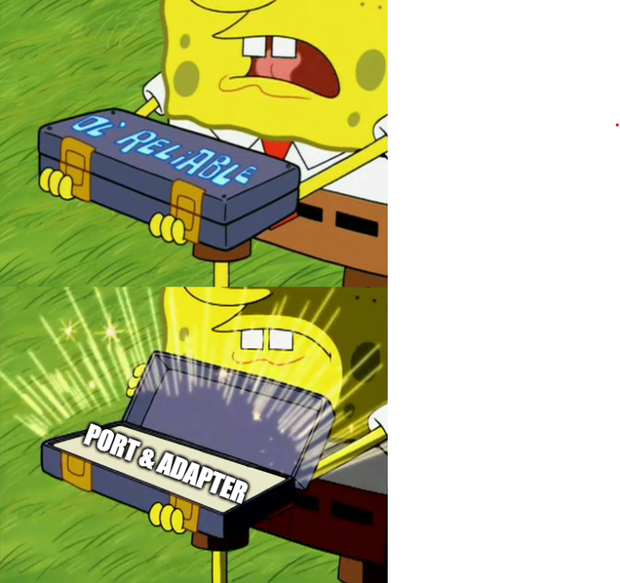

# Domain observability
*Temps de lecture:* **5 minutes**

Too Long; Didn't Read;
> Lorsque l'on cherche à isoler le domaine des problématiques techniques en DDD, le log et les métriques sont généralement les dernières incursions techniques restantes dans le domaine. Il est possible d'éliminer ce problème grâce à l'utilisation de sondes (domain probe)

Petit post sur une question récurrente des équipes ayant bien intégré le DDD et qui cherchent à respecter la [clean architecture](https://blog.cleancoder.com/uncle-bob/2012/08/13/the-clean-architecture.html), qui est en place sur bon nombre des projets C# ici.

## Situation initiale
Prenons un service basique de création de produit:

```csharp
public class ProductService
{
    private readonly IProductRepository _productRepository;
    private readonly ILogger _logger;
    private readonly IMetric _metrics;

    public ProductService(IProductRepository productRepository, ILogger logger, Imetrics metrics)
    {
        _productRepository = productRepository ?? throw new ArgumentNullException(nameof(productReportRepository));
        _logger = logger ?? throw new ArgumentNullException(nameof(logger));
        _metrics = metrics ?? throw new ArgumentNullException(nameof(metrics));
    }

    public async Task CreateNewProduct(ProductCreationRequest productCreationRequest)
    {
        try
        {
            if(await _productRepository.IsGtinAlreadyUsed(productCreationRequest.Gtin))
            {
                _logger.LogError($"DuplicateGtinException - gtin already in use ({productCreationRequest.Gtin})");
                throw new DuplicateGtinException(productCreationRequest.Gtin);
            }

            var product = new Product(
                productCreationRequest.Gtin,
                productCreationRequest.Name,
                productCreationRequest.Brand,
                productCreationRequest.CategoryCode
            )

            await _productRepository.Create(product);
            _metrics.Measure.Counter.Increment(new CounterOptions { Name = "ProductCreationr" });
        } catch (InvalidProductException e)
        {
            _logger.LogError(e, "InvalidProductException - Error while creating product");
            _metrics.Measure.Counter.Increment(new CounterOptions { Name = "ProductCreationError" });
            throw;
        }
    }
}
```

Le service se trouve dans le domaine (couche useCase si on parle clean architecture originale). On y injecte un productRepository et le gros de la logique de validation semble être dans dans le product (sauf la validation du Gtin, on a ici un domaine plus [pur que complet](https://enterprisecraftsmanship.com/posts/domain-model-purity-completeness/).

Pas trop mal niveau séparation des concerns techniques et métiers. Quel est le problème alors ?

## Ilogger et IMetrics sont des détails techniques
[ILogger](https://learn.microsoft.com/fr-fr/dotnet/api/microsoft.extensions.logging.ilogger?view=dotnet-plat-ext-8.0) provient de l'extension logging et [IMetrics](https://learn.microsoft.com/en-us/dotnet/api/microsoft.azure.applicationinsights.query.imetrics?view=azure-dotnet-legacy) du systeme d'application insights. Ce sont tous deux des choix techniques d'utiliser ces solutions, il est possible d'utiliser d'autres libs pour logger ou suivre les métriques d'une application.
Si demain je décide d'utiliser [IMeter](https://learn.microsoft.com/en-us/dotnet/core/diagnostics/metrics-instrumentation) pour la mesure des metriques, alors que je serai forcé de toucher la couche domaine (ou application) pour des raisons techniques, ce qui est justement ce que l'on souhaite éviter avec notre architecture en couches.

## On utilise un Proxy ?
Pour pallier à ce soucis, une première idée pourrait être d'utiliser le [pattern proxy](https://refactoring.guru/design-patterns/proxy).
Pour le logger on pourrait avoir une encapsulation comme ça: 

```csharp
public class ProxyLogger : IProxyLogger
{
    private readonly ILogger _logger;

    ProxyLogger(ILogger logger)
    {
        _logger = logger ?? throw new ArgumentNullException(nameof(logger));
    }
    public void LogError(Exception e, string message)
    {
        _logger.LogError(e, message);
    }

    public void LogError(string message)
    {
        _logger.LogError(message);
    }

    // .. autres méthodes de log
}
```

Avec l'interface dans le domaine et l'implémentation dans l'infra, on a déjà le mérite d'isoler la dépendance externe. Si l'on change de lib de log, alors il suffit de mettre à jour le proxy, le domaine ne sera pas impacté.

C'est mieux, mais il n'empéche que le domaine doit toujours savoir comment tagguer tel ou tel message (error, info, debug, ...). Il gére également le format de la sortie, via le string qu'il envoie. Si on doit ajouter des références techniques ou même faire un assemblage particulier selon l'outil qui traitera ces logs, alors c'est que l'on a toujours pas réussi à découpler correctement le métier de la technique.

## La solution: Domain Probe
L'idée va être d'utiliser le classique [port and adapter](https://medium.com/ssense-tech/hexagonal-architecture-there-are-always-two-sides-to-every-story-bc0780ed7d9c), avec une interface métier dans le domaine, et une implémentation technique dans l'infra



L'idée est de créer une sonde métier (voir le très bon article sur le blog de martin fowler: [domain probe](https://martinfowler.com/articles/domain-oriented-observability.html)). Via elle, le domaine pourra faire remonter l'information qu'un **évenement métier** est arrivé. Ensuite, libre à l'implémentation de logger cet événement, l'ajouter sur une métrique, de faire une notif mail... Ou même tous à la fois en utilisant un [observateur](https://refactoring.guru/design-patterns/observer) ou le [pattern composite](https://refactoring.guru/design-patterns/composite).

Ici notre sonde ressemblerait à ça:

```csharp
public interface ProductCreationProbe
{
    void SuccessfulProductCreation();
    void DuplicateGtinCreation(string gtin);

    void ProductCreationProblem(InvalidProductException e);
}
```

Notre service devient alors

```csharp
public class ProductService
{
    private readonly IProductRepository _productRepository;
    private readonly ProductCreationProbe _probe;

    public ProductService(IProductRepository productRepository, ProductCreationProbe probe)
    {
        _productRepository = productRepository ?? throw new ArgumentNullException(nameof(productReportRepository));
        _probe = probe ?? throw new ArgumentNullException(nameof(probe));
    }

    public async Task CreateNewProduct(ProductCreationRequest productCreationRequest)
    {
        try
        {
            if(await _productRepository.IsGtinAlreadyUsed(productCreationRequest.Gtin))
            {
                _probe.DuplicateGtinCreation(productCreationRequest.Gtin);
                throw new DuplicateGtinException(productCreationRequest.Gtin);
            }

            var product = new Product(
                productCreationRequest.Gtin,
                productCreationRequest.Name,
                productCreationRequest.Brand,
                productCreationRequest.CategoryCode
            )

            await _productRepository.Create(product);
            _probe.SuccessfulProductCreation();
        } catch (InvalidProductException e)
        {
            _probe.ProductCreationProblem(e);
            throw;
        }
    }
}
```

Notre domaine ne parle plus que le language métier. Plus de trace technique, il ne sait plus qu'il doit à la fois logger et compter dans les métrique un probléme de création du produit. Il prévient juste l'extérieur que ce problème est survenu, via la sonde.

Petit soucis côté infra, on se retrouve à devoir implémenter une sonde devant à la fois logguer et gérer des métriques.
Pour assurer le respect du [Single Responsability Principle](https://blog.cleancoder.com/uncle-bob/2014/05/08/SingleReponsibilityPrinciple.html),  il suffit que notre implémentation soit une [façade](https://refactoring.guru/design-patterns/facade) assez simple:

```csharp
public class ProductCreationProberLoggerMetrics : ProductCreationProbe
{
    private readonly ILogger logger;
    private readonly IMetrics metrics;

    public ProductCreationProberLoggerMetrics(ILogger logger, Imetrics metrics)
    {
        _logger = logger ?? throw new ArgumentNullException(nameof(logger));
        _metrics = metrics ?? throw new ArgumentNullException(nameof(metrics));
    }

    public void SuccessfulProductCreation()
    {
        _metrics.Measure.Counter.Increment(new CounterOptions { Name = "ProductCreation" });
    }

    public void DuplicateGtinCreation(string gtin)
    {
        _logger.LogError($"DuplicateGtinException - gtin already in use ({gtin})");
    }

    public void ProductCreationProblem(InvalidProductException e)
    {
        _logger.LogError(e, "InvalidProductException - Error while creating product");
        _metrics.Measure.Counter.Increment(new CounterOptions { Name = "ProductCreationError" });
    }
}
```

On est d'accord, on est sur une *problème de riche*. Si la seule violation des principes du DDD qu'il reste dans votre application sont sur ce genre de point, alors c'est que vous exprimez déjà correctement votre domaine, avec des entités riches, ce qui est super.
L'idée était juste de vous montrer une solution à un problème que l'on finit souvent par rencontrer lorsque l'on arrive à faire émerger un domaine correctement construit 😁

Merci d'avoir lu ce post, et à la prochaine fois 😉