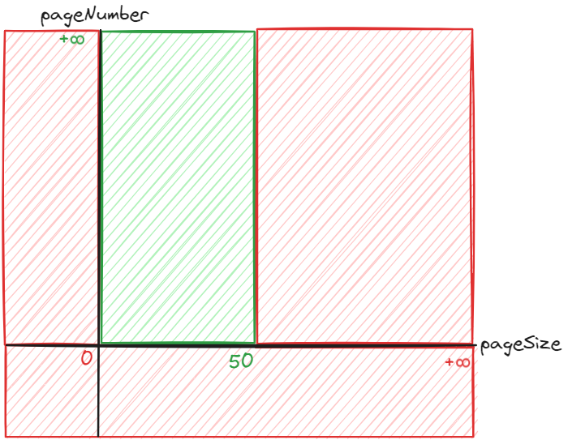

# Edge testing - tests aux limites
*Temps de lecture* **7 minutes**

Pour une rentrée légere, petit rappel sur les tests avec un concept que vous connaissez sûrement 😁

Too Long; Didn't Read;
> Couvrir les bornes extrêmes des paramètres d'entrée permet de rendre les tests plus robustes et aide à documenter les limites de l'application.
> Exemple de borne pour un entier dont la valeur est comprise entre 1 et 100: 0, 101 (cassant) et 1, 100 (passant)

Peut importe le niveau de vos tests - TU d'une méthode, d'une classe, TI, test d'acceptance, ... -, on chercher généralement trois types de scénarios :
* **Cas passants**, les exemples de fonctionnement nominal où tout est censé fonctionner
* **Cas cassants**, les cas problématiques, qui vont finir en exception ou autre résultat en erreur
* **Cas aux limites**, qui sont passants et cassants, qui font la transition entre ces deux domaines

## Avec un exemple
Imaginons que l'on doive faire des tests d'intégration sur une route GET permettant de récupérer des produits, et qui gère la pagination. On a deux paramètres en entrée qui peuvent varier :
* `pageSize`, le nombre de produits retournés, qui peut varier entre 1 et 50, avec pour valeur par défaut 20
* `pageNumber`, le numéro de la page souhaité, qui doit être supérieur ou égale à 1 et qui vaut 1 par défaut. Demandé une page dépassant le nombre max de pages est considéré comme un cas passant (retour 200) qui renverra simplement une liste vide

Niveau comportement, on va pouvoir tester les cas passants pour vérifier les valeurs par défaut (un appel sans paramètre renvoi les 20 premiers éléments) et pour les cas cassants, on peut essayer de mettre autre chose qu'un entier dans ces deux champs.

### Limites d'un paramètre
Pour les cas de test un peu plus poussés, intéressons-nous d'abord à `pageSize`. Si l'on représente sa plage de valeur avec les valeurs passantes en vers et cassantes en rouge, on obtient ceci :

Nous avons donc déjà un test pour la valeur par défaut 20. Si on ajoute un cas passant plus grand (**ex: 45**) et un cas cassant (**60**), alors voilà ce que nous décrivent ces tests :

Avec ces cas de tests, on peut normalement être à-peu-près convaincu que:
* toutes les valeurs entre 20 et 45 doivent fonctionner
* que les valeurs au-delà de 60 cassent (même si un second test avec une valeur beaucoup plus grande nous aiderait à être plus confiants)

Par contre, ces tests ne nous apprennent rien, et donc ne nous assurent de rien, pour les valeurs
* entre 46 et 59. On pourrait renvoyer une erreur pour une size à 47, les tests passeraient toujours
* inférieures à 20. -1 pourrait ne pas retourner d'erreur, les tests ne casseraient pas

D'où l'intérêt de tester les valeurs limites, qui représentent la frontière entre cas passants et cas cassants.
On peut donc ajouter des tests pour nos limites 49 et 50:

Ce qui nous permet de lever le doute sur le point de bascule entre cas passants et cassants à ce niveau.
Il nous reste à faire de même pour 0 et 1 pour bien valider par les tests notre paramètre `pageSize`

### Limites de plusieurs paramètres
Vous avez compris le principe et l'intérêt de tester les cas aux limites 🙂
Vous vous doutez maintenant que l'on pourrait faire le même exercice avec `pageNumber`, on obtiendrait alors ceci:

Mais nos deux paramètres existent ensemble. Du point de vue de notre route, notre plage de valeur ressemble donc plus à ceci :

Dés lors, nos cas aux limites se trouvent à chaque angle faisant la jonction entre les cas passants et cassants
Exemples, notés (pageSize, pageNumber):
* L'angle en bas à gauche nous donne (0,0), (1,0), (0,1) et (1,1) - seul cas passant
* L'angle en bas à droite correspond à (50,0), (51,0), (50,1) et (51,1)
* etc, ..

Ce genre de scénario est extrêmement important. En effet, cela apporte de tester chaque paramètre indépendamment des autres, mais les interactions des différents cas aux limites peuvent comporter des bugs complexes à détecter ou à corriger, d'où l'utilité d'avoir des tests les couvrant 🙂

## Limites des ... limites
Vous l'avez sûrement déjà compris, si vous souhaitez tester l'ensemble de vos cas aux limites, sur l'ensemble de vos couches de tests (TU, TI, E2E), vous allez devoir développer et maintenir un grand nombre de tests. Avec en prime des redites sur les différentes couches.

De même en ce qui concerne les combinaisons. Imaginons que nous ajoutions des filtres à notre route, pour ajouter la possibilité de limiter les produits par des mots présents dans le nom ou des prix. Il n'est pas intéressant de multiplier les tests où l'on mets tous les paramètres de pagination et de filtrage ensemble puis de les faire varier 1 à 1, pour avoir l'exhaustivité des cas aux limites.

Il faut, comme toujours, bien réfléchir à l'intérêt des tests. Un test n'a de raison d'exister que si le gain qu'il apporte (réduction du risque de régression, facilitation de la correction d'éventuels bugs, documentation, ...) est supérieur au temps qu'aura demandé son écriture initiale puis ses évolutions.

On ne fait pas de [preuve de code](https://betterprogramming.pub/a-taste-of-coq-and-correct-code-by-construction-111bf74d3b98). Les tests ne sont que des exemples que nous vérifions, sans garantie absolue que les autres cas non testés seront ok. La bonne quantité de test est celle avec laquelle l'équipe de dévs se sent en confiance et qui permet de livrer une qualité suffisante pour le projet (on n'a pas les mêmes attentes de non régression sur un backend pour une équipe interne que pour le site cdiscount).

## En conclusion
Réfléchir ses tests en termes de cas passants / cassants / aux limites vous permet de penser à plus de scénarios pertinents et aide à la formalisation de ces tests. Il n'est néanmoins pas nécessaire de transformer tous ces scénarios en tests.

Ce genre de réflexion sur les limites ne s'applique pas qu'aux types entiers ou décimaux, vous pouvez le faire sur la longueur d'un string, la taille d'une liste, la dimension d'une matrice, la profondeur d'un arbre, ...

J'espère que ça vous aidera pour vos futurs tests, à tuer des mutants au passage, et pourquoi pas faciliter vos tentatives de TDD 😉