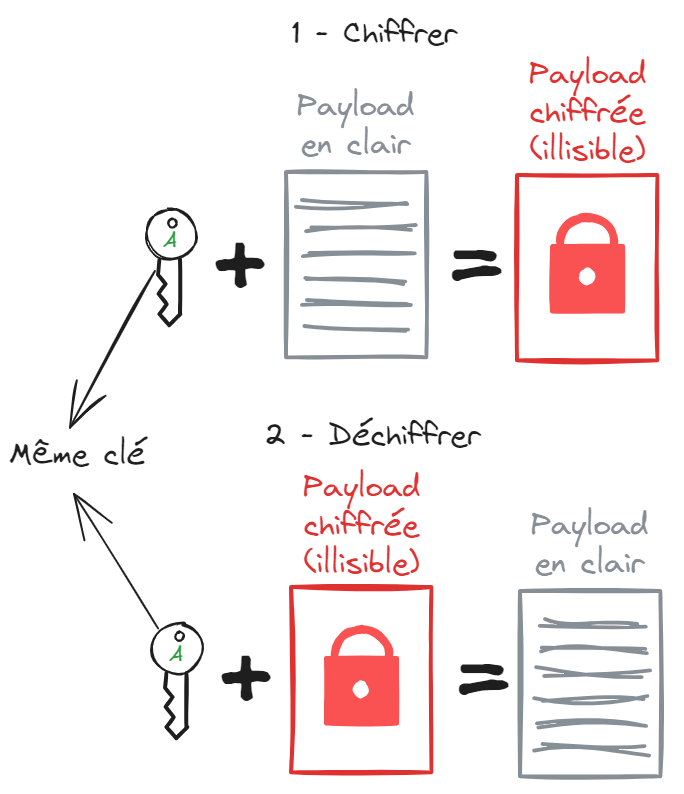
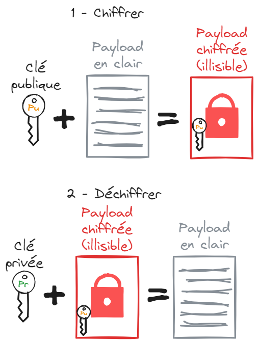
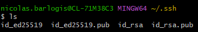
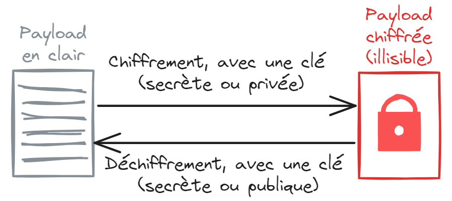
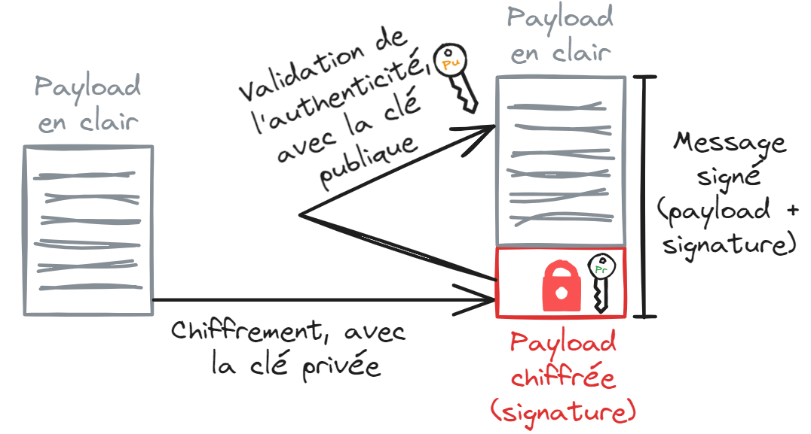
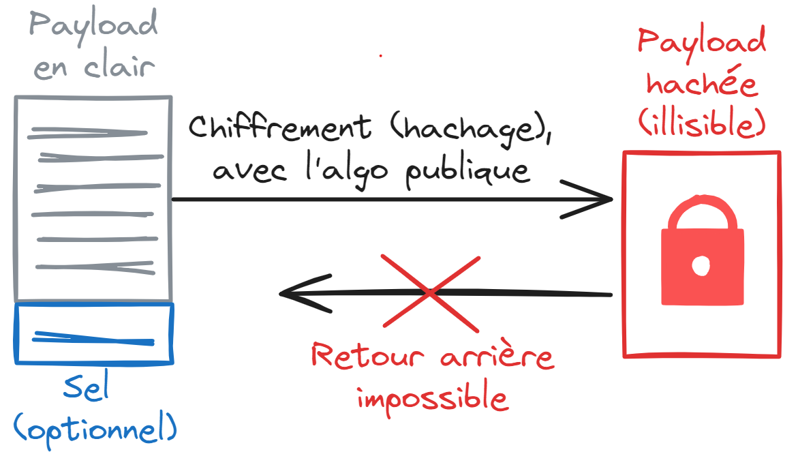
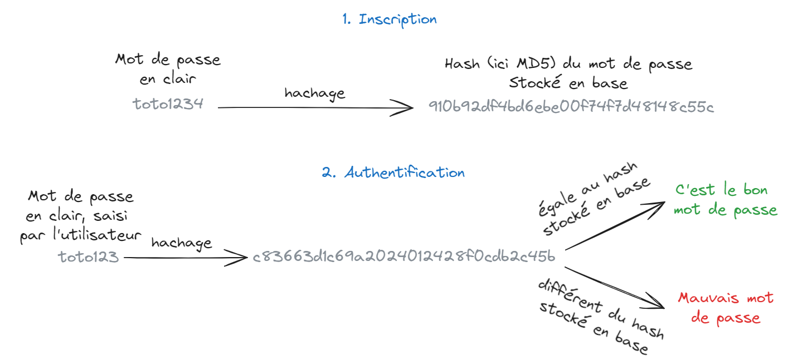
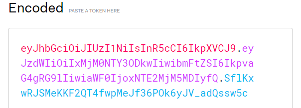

# Json Web Token (JWT), refresh token et access token
*Temps de lecture* **10 minutes**

Hello Craftmanship, aujourd'hui je tente quelque chose d'un peu différent, on va faire de la culture générale en informatique 🤓

Too Long; Didn't Read;
> Un Json Web Token est un message contenant des informations (payload) et la signature de ces informations par l'émetteur du token. Les JWT sont aujourd'hui largement utilisés, notamment pour l'authentification stateless.

On va parler cryptologie, et plus précisément des JWT, que vous manipulez tous les jours, notamment au travers de l'authentification keycloack 🙂 

Avant toute chose, il est nécessaire de comprendre un certain nombre de concepts pour pouvoir aborder les JWT et leur fonctionnement. La suite va être organisée par concepts, n'hésitez pas à passer ce qui est déjà clair pour vous et aller directement aux sections qui ne vous parlent pas 🙂 

## Chiffrement symétrique vs chiffrement asymétrique
Pour chiffrer et déchiffrer des messages (payloads), on distingue deux ensembles d'algorithmes fonctionnements soit
* Avec un unique secret (ou clé secrète), qui sera utilisé pour chiffrer puis déchiffrer
* Avec un secret (clé publique) qui sert à chiffrer, et un élément public (clé publique) qui sert à déchiffrer

### Chiffrement symétrique

Le [chiffrement symétrique](https://fr.wikipedia.org/wiki/Cryptographie_sym%C3%A9trique) permet de chiffrer et déchiffrer un message, via une unique clé secrète. Les algorithmes de chiffrement symétrique sont beaucoup plus rapide que leurs équivalent asymétrique. 
La problématique de leur usage vient du fait qu'il faut réussir à partager la clé entre les deux personnes (disons Alice et Bob) qui échangent, sans risquer qu'elle soit récupérée par un tierce. En effet, impossible de pour Alice de chiffrer la clé pour l'envoyer à Bob, car il aurait besoin de la clé pour déchiffrer... la clé. échange initial est le point critique du chiffrement symétrique.

### Chiffrement asymétrique

Le [chiffrement asymétrique](https://fr.wikipedia.org/wiki/Cryptographie_asym%C3%A9trique) permet de résoudre le problème du partage de clé en chiffrement symétrique. En effet, si Alice veut envoyer un message de façon sécurisée à Bob, elle va générer une paire de clés:
* Une clé privée, qu'elle seule doit connaitre
* Une clé publique, qu'elle peut communiquer librement à tous ceux avec qui elle veut communiquer

L'idée des deux clés est la suivante:
* Ce qui a été chiffré avec la clé publique ne peut être déchiffré qu'avec la clé privée
* Inversement, ce qui a été chiffré avec la clé privée ne peut être déchiffré qu'avec la clé publique

*Note*: c'est ce genre de clés que vous utilisez pour les connexions ssh aux repositories ou serveurs, et que vous voyez dans votre .ssh. Les .pub sont vos clés publiques, partageables, les autres vos clés privées, à ne surtout pas divulguer.

Si Bob souhaite envoyer un message chiffré à Alice, il va devoir demander à Alice sa clé publique.
Une fois en possession de la clé publique d'Alice, il peut chiffrer son message, avec cette clé. Ainsi, seule la clé privée d'Alice, qu'elle est normalement la seule à posséder, peut déchiffrer ce message. Il peut donc sereinement envoyer son message chiffré à Alice.
Maintenant si Alice veut répondre, elle va devoir répéter l'opération dans l'autre sens, et chiffrer son message avec la clé publique de Bob.

Le chiffrement asymétrique permet de se débarrasser de la problématique du partage de clé, mais apporte un peu plus de complexité (4 clés au lieu d'une pour un échange entre deux personne), et des algos généralement [un peu moins rapides](https://preyproject.com/blog/types-of-encryption-symmetric-or-asymmetric-rsa-or-aes#:~:text=Choosing%20between%20asymmetric%20vs%20symmetric).

*Note*: on peut avoir les avantages des deux types de chiffrements (rapidité du symétrique, sans risque de faire fuiter la clé au partage) utilisant une connexion asymétrique pour partager une clé symétrique, puis en échangeant en symétrique. C'est comme ça que [fonctionne le SSL/TLS](https://fr.wikipedia.org/wiki/Transport_Layer_Security#:~:text=authentification%20forte.-,Principe%20de%20fonctionnement%20dans%20les%20navigateurs%20web,-%5Bmodifier%20%7C) par exemple.

## Vocabulaire: chiffrer, signer, hacher, encoder
Deuxième étape: fixer le vocabulaire de base. La différence entre les termes chiffrer, signer, hacher et encoder peuvent sembler assez flou, mais chacun fait référence à une action bien particulière, on va les balayer ici.

### Chiffrer

Le chiffrement permet d'avoir une payload chiffrée puis de la déchiffrer ensuite (opération réversible). On a vu plus haut la gestion des clés en mode symétrique et asymétrique pour la partie chiffrement.

### Signer

L'objectif de la signature n'est pas d'échanger de façon sécurisé un message. L'idée est, comme pour une vraie signature, d'attester de qui a écrit ce message.

Si Alice veut écrire un mail signé, elle va créer un message contenant son mail en clair, ainsi que le résultat du chiffrement de ce même mail, avec sa clé privée. C'est cette partie chiffrée que l'on appel la signature.
Lorsque Bob reçoit ce message, s'il veut s'assurer que le mail en clair a bien été écrit par Alice, et n'a pas été modifié, il peut déchiffrer la signature avec la clé publique d'Alice. Comme la clé publique d'Alice ne déchiffre que les messages chiffrés avec la clé privée d'Alice, qu'elle seule possède, alors si la signature déchiffrée est la même que le mail en clair, alors le mail a bien été écrit par Alice. 

### Hacher (hash)

Hacher permet de chiffrer (--> hacher dans ce contexte)  une donnée. La différence avec le chiffrement est qu'il est impossible de faire le chemin inverse. On ne peut récupérer la donnée en clair à partir du message chiffré (message chiffré que l'on appel un hash).
On peut hacher n'importe quelle payload (du texte, un exécutable, un pdf, ...), et pour une même entrée on aura toujours la même sortie.

C'est typiquement utilisé pour stocker des mots de passe. L'utilisateur s'inscrit et me donne son mot de passe en clair. On ne souhaite pas le stocker en clair dans la bdd, pour limiter le risque de fuite de mot de passe, mais on voudra tout de même vérifier plus tard que le mot de passe que saisit l'utilisateur à l'authentification est bien le même que celui qu'il a défini à l'inscription.

Pour cela on hash le mot de passe à l'inscription, et l'on stocke ce hash. Ensuite, lors d'une tentative de connexion, on recevra un mot de passe en clair. Il suffit de le hacher, et de comparer avec le hash de référence en bdd. S'ils sont identiques alors c'est le bon mot de passe qui a été saisi (il y a [des limites](https://fr.wikipedia.org/wiki/Collision_(informatique)) en théorie, mais on commence à partir trop loin pour ce petit article 😅). 

### Encoder
Un encodage est juste une façon de représenter/stocker une donnée. Aucune notion de sécurité derrière l'encodage, contrairement à ce que l'on peut parfois entendre 🤓

Vous connaissez surement des encodages pour le texte, que l'on peut représenter au format ascii, son extension le Latin-1, ou encore l'UTF-8. 

Pour commencer à basculer dans le monde des JWT, vous savez peut-être que ces tokens sont encodés en base64url.

Cela fait qu'ils ne sont pas lisibles pour un humain directement, mais l'information n'est pas cachée pour autant. N'importe qui peut passer de la base64url vers un autre encodage lisible et lire les données. Aucun secret sur cette partie. On le verra, c'est d'ailleurs le but du JWT qu'il soit lisible par tous.
Ici l'encodage sert uniquement à ce que la payload du token puisse être passée via une url, d'où la variante base64url. Le json pouvant contenir des points, il n'est pas toujours possible de le mettre dans une url. L'encodage résout ici ce problème.

## Qu'est-ce qu'un JWT ?

## Authentification Stateful et Stateless

## Refresh token et access token

## Le mot de la fin
Voilà pour ce post un peu dense et assez différent de ce qu'on propose d'habitude. Et il y a plein d'autres sujets dans le genre que l'on pourrait par exemple voir :

* TLS (la couche de sécurisation du HTTPS ou de SSH)
* Le fonctionnement des certificats et autorités de certification
* Des concepts autour de la sécurité réseau/systéme (DMZ, WAF, VLAN, VPN, durcissement d'OS, ...)
* Le fonctionnement plus poussé de la couche IP (BGP, FAI niveau 1/2/3, ...)
* Des zooms sur des protocoles annexes qui font fonctionner tout ce qu'on utilise (SMTP, NTP, DNS, ...)
* Aborder la théorie des langages, les meta-langages, les compilateurs et leurs fonctionnements

Bref, plein d'idées possibles. Dites le si ça vous a plu et si on devrait en faire d'autres dans le genre !