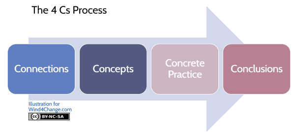
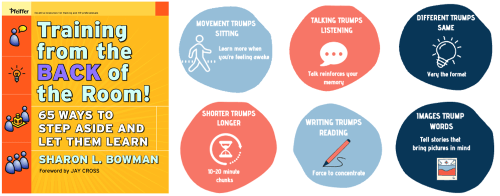
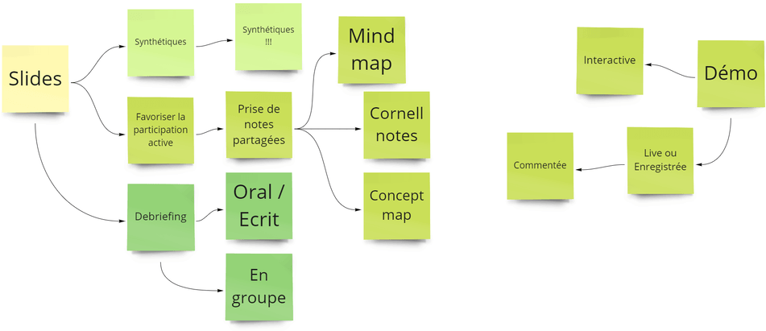
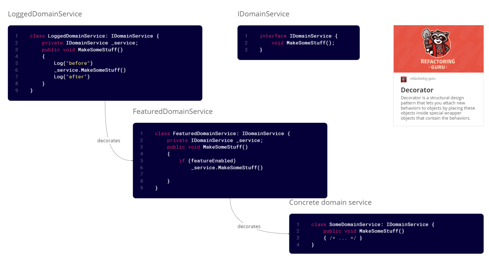

# Learning Hours
*Temps de lecture* **4 minutes**

Too Long; Didn't Read;
>

 Aujourd'hui une com en forme de victoire puisque dernièrement, des ateliers au format Learning Hour, élaborés dans le cadre des accompagnements d'équipes pour Peaksys, ont été publiés sur le site de [Samman Coaching](https://sammancoaching.org/) :
- [3 Styles of unit tests](https://sammancoaching.org/learning_hours/test_design/styles_of_unit_tests.html)
- [Refactoring test inputs with Test Data Builders](https://sammancoaching.org/learning_hours/test_design/test_data_builders.html)
 
Une "Learning Hour", c'est un atelier structuré permettant de transmettre une compétence technique en laissant 
une grande place à la pratique.
 
La structure de l'atelier suit les 4C de *[Training from the back of the room](https://bowperson.com/)* (TBR) pour connecter les participants avec le sujet, leur transmettre une compétence et la mettre en application rapidement, et enfin leur permettre de se projeter sur la suite, c'est-à-dire son utilisation en situation réelle.

1 *Learning Hour* est donc composée de 4 temps distincts :
 
## Connection (3 à 5 minutes)
Les participants établissent des liens avec ce qu'ils savent (ou pensent savoir) sur le sujet abordé, ce qu'ils veulent apprendre et ce qu'ils vont apprendre. 

On réalise à la fois un échauffement du cerveau et une mise en contexte.
 
## Concepts (5 à 10 minutes)
Oubliez les supports de présentation traditionnels, les but de cette étape est d'apprendre en sollicitant les participants.
On se base ici sur les "6 trumps" de TBR :
1. Movement trumps sitting,
2. Talking trumps listening,
3. Images trump words,
4. Writing trumps reading,
5. Shorter trumps longer,
6. Different trumps same.

Pour cela, un board miro est le bienvenu, permettant la prise de notes partagées en direct. Des temps d'échange / debriefing sont également à privilégier pour les participants. Cela leur permet de reformuler et donc de s'approprier plus facilement le nouveau concept.

Une démo du sujet abordé permet une bonne transition vers le point suivant : la pratique
 
## Concret practice (minimum 40 minutes)
La phase la plus importante : la mise en pratique immédiate de la compétence apprise. Le format est volontairement simple : l'objectif est que les participants manipulent et s'approprient le nouveau concept. On élimine ainsi les difficultés autres que celles liées à la compétence ciblée.
 
Un kata de code est forcément l'arme préférée du coach craft, surtout si celui-ci se déroule en [Mob Programming](https://confluence.cdiscount.com/display/COACHCRAFT/Mob+Programming), mais une revue de code ou une mise en situation sont également d'autres possibilités. 
 
## Conclusion (3 à 5 minutes)
Avant de se quitter, ou de passer au concept suivant, cette phase permet aux participants d'évaluer ce qu'ils ont appris, comment ils vont pouvoir l'utiliser et anticiper les prochaines étapes de montée en compétence.
 
 
 
Bonne nouvelle, la **structure 4C** ne s'applique pas uniquement à des ateliers d'1 heure. Elle fonctionne également sur des formations plus longues (comme les [formations TDD et Clean Code](https://insight.cdbdx.biz/course/view.php?id=309)), pour élaborer une présentation technique, ou lors d'un refactoring nécessitant la mise en place du [Pattern Decorator](https://refactoring.guru/design-patterns/decorator).

[Un article est disponible sur ce pattern](../decorator-pattern/decorator-pattern.md) 😉
 
## Quelques ressources pour terminer
* Un repo de [Learning Hours](https://github.com/katalogs/learning-hours/) pour expérimenter les [tests d'architecture](https://github.com/katalogs/learning-hours/blob/main/archunit/Facilitation.md),  les [options](https://github.com/katalogs/learning-hours/blob/main/functional-programming/3-monads-part1/Facilitation.md), le [specification pattern](https://github.com/katalogs/learning-hours/blob/main/specification-pattern/discover-specification-pattern/Facilitation.md) ou d'autres sujets
* Des exemples d'activités de [connexion](https://sammancoaching.org/activities/connect.html) et de [conclusion](https://sammancoaching.org/activities/conclusions.html) sur le site Samman Coaching
* Une documentation sur le pattern [Test Data Builder](https://confluence.cdiscount.com/display/COACHCRAFT/Test+data+builders) (dans confluence 🤩)

Happy Crafting