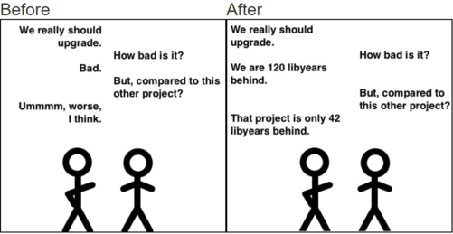
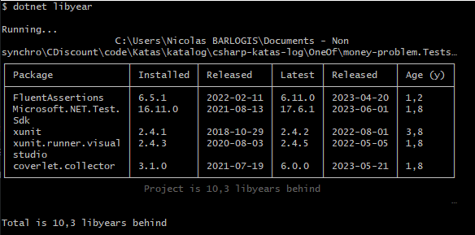
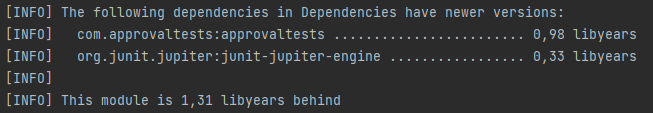

# Libyear
*Temps de lecture* **1 minute**

Too Long; Didn't Read;
> [Libyear](https://libyear.com/) un petit outil sympa pour vous aider à suivre les retards de mise à jour de vos dépendances
>
> 
 
 
Le concept est très simple. Pour chacune de vos dépendances, il regarde le temps qui s'est écoulé entre la version installée et la dernière version disponible. Exemple: j'ai une dépendance en 3.1 sortie en juin 2022, la dernière version est la 3.3 de mars 2023, libyear ajoute 9 mois à mon score.
 
Exemple de sorties pour un projet dotnet et un autre maven: 
 
 
 
 
 
L'idée est de pouvoir comparer vos différents projets pour upgrader en priorité celui qui en a le plus besoin, ou de pouvoir suivre l'évolution du score d'un projet pour éviter que le retard de celui-ci explose trop.
 
La lib est dispo pour pas mal de gestionnaires de paquets (nuget, gradel/maven, npm, PyPI....).
 
Si vous voulez tester par curiosité sur vos projets, n'hésitez pas ça prends pas plus de 5 minutes 😁