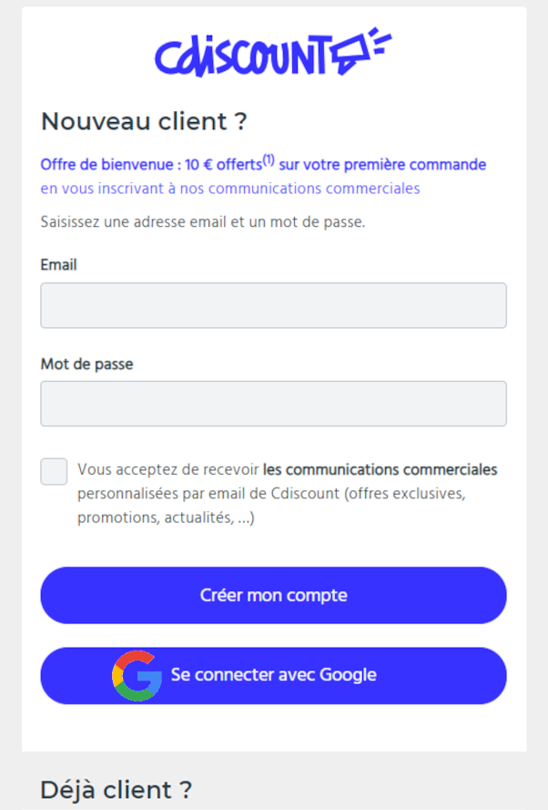
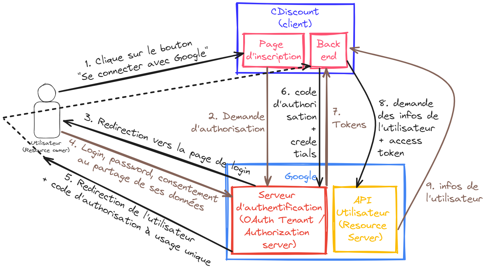
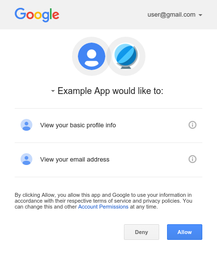
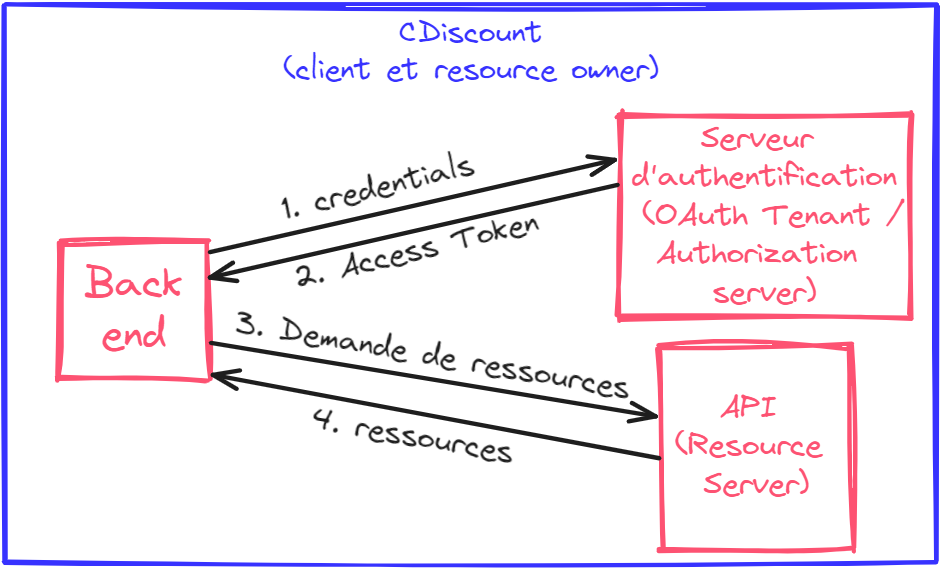

# Open Authorization (OAuth)2.0 - Délégation d'autorisation
*Temps de lecture* **9 minutes**

Hello Craftmanship, vu que les sujets tech orientés culture générale sont assez appréciés (je vous partagerai les retours du sondage sous peu), je vous en propose un nouveau, car on en a fait assez peu.

[Lire l'article sur le repository des communications craft](http://tfs:8080/tfs/DefaultCollection/craftmanship/_git/coms-craft?path=%2Foauth2%2Foauth2.md&_a=preview)

Too Long; Didn't Read;
> OAuth2 est un protocole d'autorisation (et non d'authentification, du moins pas principalement), permettant à un utilisateur d'utiliser une application (site web ou autre) en utilisant un compte venant d'un autre service. Ce protocole est assez connu, notamment via les 'se connecter avec Google', 'se connecter avec Meta', ... qui permettent d'accéder à de nombreux sites, sans créer de compte. Il existe d'autres modes de fonctionnement pour OAuth2, notamment pour permettre le machine to machine.

Maintenant que vous savez ce [que sont les JWT et comment ils fonctionnent](http://tfs:8080/tfs/DefaultCollection/craftmanship/_git/coms-craft?path=%2Fjwt%2Fjwt.md&_a=preview), je vous propose qu'on aille un peu plus, et que l'on creuse le protocole OAuth2.0, qui est probablement aujourd'hui le protocole le plus utilisé pour déléguer l'autorisation d'accès à des ressources🙂

Et avec cette très belle phrase, vous n'êtes pas forcément plus avancés. Pas de soucis, on va reprendre par les bases, comprendre ce qu'est l'autorisation.

## Authentification vs Autorisation (Authentication vs Authorization)
### Authentification
On a souvent tendance à mélanger un peu ces deux concepts, notamment à cause des solutions de gestion d'utilisateurs - comme Keycloak - qui font les deux: authentification et autorisation.

Authentifier consiste à valider l'identité d'un utilisateur. C'est ce que l'on avait pour les JWT, pour l'obtention du refresh token. L'utilisateur fournit ses login et mot de passe, que lui seul est censé connaître. En échange de cela, il obtient un refresh token, que lui donne le système auprès duquel il s'authentifie.

On peut reprendre l'image de la carte d'identité. Elle assure uniquement que vous êtes bien celui que vous prétendez être, pour peu que l'on fasse confiance à l'émetteur de la carte d'identité (du refresh token). En elle-même, cette carte ne vous autorise à rien.

### Autorisation
 L'autorisation intervient ensuite. Elle consiste à vérifier les droits de l'utilisateur dans le système. Ce qu'il peut ou ne peut pas faire.
 
En prenant l'exemple de ce qui se passe chez CDIscount et Octopia, tous les utilisateurs (clients, admins, développeurs, vendeurs, ...) s'authentifient tous (😉) auprès de l'autorité interne de CDiscount, Keycloack. Tous obtiennent des tokens similaires, prouvant leurs identités, c'est l'étape d'authentification.

Par contre, les access tokens qu'ils obtiendront ne permettront tous pas de faire les mêmes actions. Ici, cela est aussi géré par Keycloack, qui attachera aux tokens les rôles donnés à chaque utilisateur. Grâce à ces rôles, les différentes API consommées pourront autoriser ou non une action, selon l'identité de l'utilisateur et les rôles qu'il possède ou non.
C'est cela, décider de l'accès ou non à des ressources / actions, que l'on appelle l'étape d'autorisation.

## OAuth2 Authorization Code Flow (User to Machine)
Open Authentication v2 (apparu en 2012 pour remplacer la v1) propose plusieurs modes de fonctionnement, appelés [flows](https://auth0.com/docs/get-started/authentication-and-authorization-flow/which-oauth-2-0-flow-should-i-use). Le plus connu, l'Authorization Code Flow, permet à un service (le client) d'accéder aux données d'un autre service (le serveur de ressources) ne lui appartenant pas.

Imaginons maintenant que le site CDiscount ait un bouton "Se connecter avec Google". Voici un magnifique montage pour vous aider à vous projeter:

Vous le connaissez sûrement, ce bouton vous permet de créer un compte sur un site, sans avoir à renseigner vos informations, mais juste en vous basant sur votre compte Google (ou Github, ou Meta, ...).

C'est ce cas d'usage que permet ce flow, qu'on désigne souvent de façon erronée comme étant le protocole OAuth2, alors qu'il n'est qu'un des cas d'usage du protocole. C'est néanmoins le plus connu, d'où le raccourci fréquent.

### Comment ça marche
Toujours dans notre exemple, ce flow va permettre au **Client** (CDiscount), d'accéder aux données du **Resource Owner** (l'utilisateur cherchant à créer un compte CDiscount).
Pour ce faire, le Ressource Owner va autoriser le Client à accéder à ses données en s'authentifiant auprès du **Authorization Server** (Serveur d'authentification de Google), qui fournira un token au Client, ce qui lui permettra d'accéder au **Resource Server** (l'API Google gérant les données de ses utilisateurs), et de récupérer les données du Resource Owner.

Ces 4 rôles (Client, Resource Owner, Resource Server et Authorization Server) se retrouvent dans tous les flow d'OAuth2. Selon les scénarios, certains rôles peuvent être joués par un même acteur. C'est notamment le cas dans le flow machine to machine que l'on verra ensuite.

En attendant, je vous propose un récapitulatif visuel du fonctionnement, on va rendre ça plus clair:

Parcourant les différentes étapes du process:
1. On commence avec un utilisateur, qui décide de s'inscrire via Google plutôt que le processus classique
2. Une fois cette demande reçue, le client (CDiscount) va initier le process d'autorisation auprès de Google, pour accéder aux données de l'utilisateur cherchant à créer son compte
3. En réponse, l'utilisateur est redirigé vers le domaine de Google, où il pourra s'authentifier via son compte existant. Ce process se fait en dehors du domaine de CDiscount, qui n'a accès à aucune des données échangées
4. L'utilisateur s'authentifie, et confirme qu'il autorise CDiscount à accéder aux informations dont il a besoin. C'est le consent screen que vous avez probablement déjà vu

5. Une fois que l'utilisateur a validé l'accès à ses données, il est renvoyé sur le site d'origine, avec un code d'autorisation, qui sera transmis au back de CDiscount, et qui sera nécessaire à l'obtention des données de l'utilisateur
6. Une fois muni de ce code, le back s'authentifie auprès de Google. D'après le minimum décrit par OAuth2, CDiscount envoie ses crédentials ainsi que le code d'autorisation...
7. ... et obtient en échange, un access token. Il est néanmoins possible d'y introduire la notion de refresh token pour éviter à CDiscount de s'authentifier pour chaque client, ou même un id token si on utilise [OpenId Connect](https://auth0.com/fr/intro-to-iam/what-is-openid-connect-oidc), un autre protocole, qui respecte et augmente OAuth2.0.
8. Muni de son access token, le client CDiscount peut finalement s'adresser au Resource Server...
9. ... et récupérer les données que le resource owner (l'utilisateur), l'a autorisé à consulter

J'espère que vous avez pu comprendre le fonctionnement de ce flow avec ces détails. 😁

### Pourquoi utiliser un code à usage unique ?
Peut-être vous posez vous une question. Dans l'étape 5, le resource owner obtient un code à usage unique, que le client utilise, couplé à ses propres identifiants, pour obtenir un access token (étapes 6 et 7).
Pourquoi ne pas simplifier ces étapes et faire en sorte qu'un access token soit directement renvoyé ? cela permettrait de supprimer certains appels et de simplifier le processus.

La réponse est extrêmement simple. C'est pour des raisons de sécurité. En effet, outre les attaques réseau ([man in the middle](https://fr.wikipedia.org/wiki/Attaque_de_l%27homme_du_milieu), http encore assez utilisé en 2012), les navigateurs / applications mobile utilisés par les resource owners sont jugés assez peu sécurisés.
Or, si l'access token transitait directement, une personne mettant la main dessus via le navigateur de l'utilisateur pourrait ensuite directement requêter ses données.

Le code à usage unique permet d'éviter cela, car il associé, chez l'authorization server (Google), au client (CDiscount). Ainsi, pour exploiter ce code et accéder aux données de l'utilisateur, il faut absolument ce code et prouver son identité en tant que CDiscount. Cela permet de drastiquement limiter la surface d'attaque, le code n'étant utilisable que par le client.

## OAuth2 Client Credentials Flow (Machine to Machine) 
En guise de conclusion, je vous présente rapidement le flow le plus simple proposé par OAuth2, le [Client Credentials Flow](https://auth0.com/docs/get-started/authentication-and-authorization-flow/client-credentials-flow).

Il est à utiliser lorsque le client et le resource owner sont le même acteur. Globalement, le cas d'usage standard est une application accédant à une autre application, dans le contexte d'une seule et même entreprise. C'est ce que l'on a ici tout le temps lorsque des API internes CDiscount ou Octopia s'appellent les unes les autres.

Le fonctionnement est très simple et va vous parler, c'est globalement celui qu'on avait introduit pour le fonctionnement des tokens dans [l'article sur les JWT](http://tfs:8080/tfs/DefaultCollection/craftmanship/_git/coms-craft?path=%2Fjwt%2Fjwt.md&_a=preview):

Basiquement:
1. Le client s'identifie auprès du serveur d'authentification. [Le moyen n'est pas précisé](https://datatracker.ietf.org/doc/html/rfc6749#section-3.2.1) (id/secret, clé ssh, ...) dans le protocole. 
2. Ici il est juste précisé que l'échange retourne un access token. Or, comme on l'a vu avec les JWT, utiliser uniquement un access token, selon sa durée de vie, peut être problématique. OAuth2 précise bien qu'il est possible d'utiliser un refresh token ([section 5.1 de la RFC](https://datatracker.ietf.org/doc/html/rfc6749#section-5.1)), mais ce dernier est optionnel.
   Globalement, le protocole est assez chiche de détails sur l'authentification, car ce n'est pas son objectif premier, qui reste principalement de proposer un protocole d'autorisation.
3. Ici l'échange est classique, l'appli client demande une ressource avec son access token
4. Et obtient en retour la ressource demandée, si son access token est valide et qu'il a les bons droits (process d'autorisation)

---

Et voilà pour OAuth2.0, j'espère avoir réussi à être clair et que vous avez pu comprendre au moins le fonctionnement de la délégation d'autorisation 😅

N'hésitez pas à proposer d'autres sujets dans le genre si vous avez, je serai ravi de pouvoir les résumer 😉