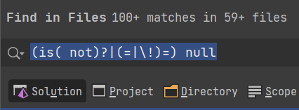
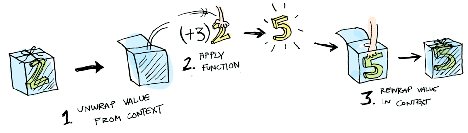
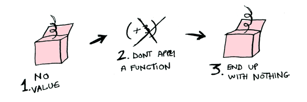

# Une option contre les null
*Temps de lecture* **6 minutes**

Too Long; Didn't Read;
>
 
Aujourd'hui commençons par un exercice : ouvrez un de vos dépôts de code dans votre IDE préféré et comptez le nombre d'occurrences du pattern suivant : *(is( not)?|(=|\!)=) null*
 
 
 
 
Si comme ici le nombre de résultats est synonyme de "beaucoup", la suite va vous intéresser.
 
## Mettons-nous en situation
Les tests de nullité servent la majeure partie du temps à arrêter un traitement. En cela ils agissent comme un [Guard](https://opus.ch/ddd-concepts-and-patterns-supple-design/), si les conditions ne sont pas réunies, le traitement s'arrête.

C'est le principe de [Fail Fast](https://www.martinfowler.com/ieeeSoftware/failFast.pdf) : le but est d'éviter d'introduire des données fausses ou d'obtenir des comportements incohérents dans notre système, mieux vaut ne rien faire plutôt que de faire n'importe quoi.

Cependant, ce principe est à réserver aux cas qui ne devraient pas se produire. Qu'en est-il des traitements qui peuvent échouer ?
 
**Prenons le scénario suivant :**
Nous devons mettre en place un service permettant à nos clients de venir retirer des produits en magasin dans la journée. Les produits peuvent nécessiter un délai d'acheminement, si celui-ci n'est plus en stock dans notre magasin, et des délais de préparation. La remise d'un produit prenant en moyenne 15 minutes, le retrait nécessite d'obtenir un rendez-vous pendant les horaires d'ouverture.
 
Le code de notre service d'éligibilité pourrait correspondre à celui-ci :

```csharp
public class ExpressCheckout
{
  public Appointment GetAvailability(string productId)
  {
      var availability = GetAvailabilityInStore(productId);
      if (availability is null)
      {
          return null; // si aucun produit n'est disponible dans la journée, échec
      }
      availability = AddPreparationTime(availability);
      var appointment = GetNextAppointment(availability);
      if (appointment is null)
      {
          LogFailure(productId, DateTime.Now);
          return null; // Si aucun rendez-vous n'est disponible, échec
      }
      Book(appointment); // réserver le rendez-vous pour le retrait
      return appointment;
  }
  private AvailableAt GetAvailabilityInStore(string productId) { /* ... */}
  private AvailableAt AddPreparationTime(AvailableAt availability) { /* ... */}
  private Appointment GetNextAppointment(AvailableAt availability) { /* ... */}
  private void Book(Appointment appointment) { /* ... */}
  private void LogFailure(productId, DateTime.Now) { /* ... */}
}
```

Inconvénients de cette implémentation :
* aucune information n'est donnée dans les signatures de méthodes sur la possibilité d'échec du traitement, ce qui est en contradiction avec le principe d'*[Intention Revealing Interface](https://herbertograca.com/2015/12/07/ddd-10-supple-design/)* cher à Eric Evans.
* le contenu de la méthode ne respecte pas l'Open/Closed Principle : à chaque nouvelle étape de traitement, nous devons l'ajouter dans notre code et décider de continuer ou non.
* les utilisateurs de ce service sont contraints de vérifier à nouveau la présence ou non d'un résultat, ce qui augmentera le nombre de tests de nullité dans la base de code.
* des blocs au contenu presque identique viennent gêner la lisibilité : *if (myVar is null) { return null; }*
 
## Existe-t-il une autre option ? 🤔
Les langages de programmation fonctionnelle bannissent les valeurs *null* car elles peuvent provoquer des erreurs impossibles à détecter par le compilateur, les rendant plus complexes à debugger. Ils fournissent ce pendant une alternative plus sûre appelée *Option*. En C#, nous pouvons utiliser la librairie [language-ext](https://github.com/louthy/language-ext) et il existe bien sûr des implémentations dans la majorité des langages.
 
Voyons notre Option comme un contexte d'exécution, une boite munie de comportements, pouvant prendre 2 états bien distincts : 
* contenir une valeur : *Some(availability)*
* être vide : *None*
 


Pour refactorer notre code, nous devons commencer par encapsuler le résultat de notre premier appel dans une *Option*, ce qui se fait facilement grâce aux opérateurs implicite et explicite :

```csharp
private Option<AvailableAt> GetAvailabilityOption(string productId) 
    => (Option<AvailableAt>) GetAvailabilityInStore(productId);
```

Maintenant que notre variable *availability* est dans sa boite, pouvons-nous lui appliquer une fonction ?
Oui, car *Option* est un *Functor*, un type de donnée qui applique une fonction à la valeur qu'il contient et retourne une nouvelle valeur encapsulée dans ce même type, grâce à la fonction *Map()*.



Et si la valeur est *null* ?
Il ne se passe rien. L'*Option* n'applique la fonction que si elle contient une valeur, sinon elle reste *None*.



De la même manière nous pouvons récupérer le prochain rendez-vous disponible :

```csharp
var appointment = GetAvailabilityOption(productId)
    .Map(AddPreparationTime)
    .Map(GetNextAppointment)
;
```

Pour effectuer la réservation, comme la valeur de l'*Option* n'est pas modifiée, nous pouvons utiliser la méthode *Do()*, qui est un *Map()* renvoyant la même instance.

```csharp
var appointment = GetAvailabilityOption(productId)
    .Map(AddPreparationTime)
    .Map(GetNextAppointment)
    .Do(Book)
;
```

À partir de ce point, deux options s'offrent à nous :
* changer la signature de notre service en retournant l'*Option* et déléguer la gestion de l'échec de réservation à la méthode appelante
* continuer de gérer l'échec dans notre méthode et renvoyer une valeur par défaut, en utilisant par exemple le pattern [Null object](https://refactoring.guru/fr/introduce-null-object)
 
```csharp
public Appointment GetAvailability(string productId)
{
    return GetAvailabilityOption(productId)
        .Map(AddPreparationTime)
        .Map(GetNextAppointment)
        .Do(Book)
        .IfNone(() => {
            LogFailure(productId, DateTime.Now);
            return new NoAppointment();
        })
    ;
}
```

Je vous laisse comparer les 2 versions.
 
## Pour aller plus loin
Les *Option* peuvent appliquer une fonction à la valeur qu'elles encapsulent, qu'elle soit présente ou non, et renvoyer le résultat dans une *Option* grâce à *Map()* car ce sont des *[Functor](https://www.adit.io/posts/2013-04-17-functors,_applicatives,_and_monads_in_pictures.html#functors)*.  Elles ont également d'autres superpouvoirs :
* elles peuvent appliquer une fonction encapsulée dans une *Option* à la valeur qu'elles encapsulent grâce à *Apply()*, car ce sont des *[Applicative](https://www.adit.io/posts/2013-04-17-functors,_applicatives,_and_monads_in_pictures.html#applicatives)*
* elles savent comment appliquer une fonction qui retourne un résultat encapsulé dans une *Option* à la valeur qu'elles contiennent grâce à *Bind()*, car ce sont des *[Monad](https://www.adit.io/posts/2013-04-17-functors,_applicatives,_and_monads_in_pictures.html#monads)*
 
Nous pouvons donc, grâce à elles, peut-être appliquer une fonction à *peut-être* une valeur ... en peu de lignes de code.
 

 
Pour terminer, une bonne nouvelle : il existe d'[autres types](https://webbureaucrat.gitlab.io/articles/safer-data-parsing-with-try-monads/) de monades, pour d'autres usages, mais nous en parlerons une prochaine fois. 
 
Happy Crafting 😉