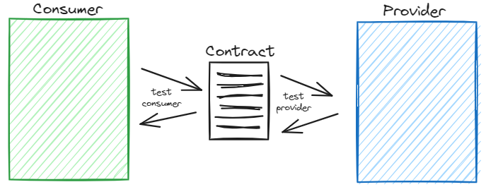

# Du bon test Pact consumer
*Temps de lecture* **7 minutes**

Petit retour sur les tests Pact, particulièrement sur les tests consumers, dont je continue à croiser des exemples imparfaits 😅

Too Long; Didn't Read;
> L'objectif d'un test de contrat est d'assurer que deux assets, partageant un même contrat d'échange, fonctionneront correctement ensemble, sans pour autant avoir besoin de faire un test en connectant réellement ces deux assets.
> Les tests consumers visent donc à tester que les composants qui se chargent des échanges (repository, connector, httpContext, ... peu importe leur nom) fonctionnent correctement et en accord avec le contrat. Donc que les requêtes envoyées sont compatibles avec le contrat et que les réponses reçues sont bien comprises

Voici un [test consumer en C#](http://tfs:8080/tfs/DefaultCollection/InternationalLogisticPartnerIntegrator/_git/partner-connector-icp?path=%2Ftests%2FPact%2FConsumer%2FOutboundShipment%2FOutboundShipmentConsumerTests.cs) prit au hasard dans un repo.
```csharp
[Fact]
public async Task AcceptOutboundShipment()
{
    const string path = "/outbound-shipments/f3ba5e8d-39bf-4c4d-b0a7-b6c70c684fb6/accept";
    const string upon = "A Put request to update outbound-shipment status to accept";
    const string given = "The outbound shipment id f3ba5e8d-39bf-4c4d-b0a7-b6c70c684fb6 is already created";

    var acceptedDto = AcceptedDtoGenerator.GetOne("icp");
    var body = JsonSerializer.Serialize(acceptedDto);
    MockProviderService
        .Given(given)
        .UponReceiving(upon)
        .With(new ProviderServiceRequest
        {
            Method = HttpVerb.Put,
            Path = path,
            Body = acceptedDto,
            Headers = _requestHeaders
        })
        .WillRespondWith(new ProviderServiceResponse
        {
            Status = 204
        });

    var finalUri = new Uri(MockProviderServiceBaseUri, path);
    var json = new StringContent(body, Encoding.UTF8, ContentType);
    var result = await HttpClient.PutAsync(finalUri, json).ConfigureAwait(false);

    Assert.NotNull(result);
    MockProviderService.VerifyInteractions();
}
```

On peut également en voir des sous [cette forme](http://tfs.cdbdx.biz:8080/tfs/DefaultCollection/ChatbotDataGateway/_git/chatbot-bff/commit/5804eab2fc6d6df61fe554ef27c3b8830d164db2?refName=refs%2Fheads%2Fmaster&path=%2Ftests%2FPact%2FConsumer%2FOrchestratorApiConsumer.cs), mais au final l'idée est la même
```csharp
[Fact]
public async Task GetOffers_BySearchWorld_ReturnsOffersNotOk()
{
    // Arrange
    var searchWord = "iphone12";
    var path = $"/offers/search/BySearchWord/{searchWord}";

    PactBuilderV3!
        .UponReceiving("A request to get offers by search word")
        .Given("The search word 'iphone12' exist and we find offers for it")
        .WithRequest(HttpMethod.Post, path)
        .WillRespond()
        .WithStatus(HttpStatusCode.InternalServerError);

    await PactBuilderV3.VerifyAsync(async ctx =>
    {
        // Act
        _httpClient.BaseAddress = ctx.MockServerUri;
        await Assert.ThrowsAsync<FlurlHttpException>(async () =>
            await _orchestratorApiProvider.GetOffersBySearchWordAsync(searchWord, null, null));
    });
}
```

Chacun de ces tests est divisé en deux parties:
### 1. La description du contrat
```csharp
PactBuilderV3!
    .UponReceiving("A request to get offers by search word")
    .Given("The search word 'iphone12' exist and we find offers for it")
    .WithRequest(HttpMethod.Post, path)
    .WillRespond()
    .WithStatus(HttpStatusCode.InternalServerError);
```
C'est la section qui décrit le contrat qui va être testé. Cette section est la même qu'un exemple qu'on pourrait trouver dans un contrat OAS.
Techniquement, Pact fait décrire ce contrat dans le consumer, mais il faut bien évidemment se mettre d'accord entre consumer et provider pour ce qui est du contenu.
Ce n'est pas au consumer d'imposer unilatéralement un format, Pact ne fournit ici qu'un support pour décrire le contrat venant d'un travail en commun (coucou design first)

### 2. Le test consumer
Le test en lui-même. L'objectif est de s'assurer que le repository (la classe qui fait l'interface entre notre application et l'API consommée) respecte et fonctionne correctement avec le contrat:
* Elle envoi des requêtes qui sont correctes vis à vis du contrat (header corrects, bon payload)
* Elle sait gérer les données retournées par l'API, dans le format du contrat (parsing, mapping)

C'est ça la base du [contract testing](https://pactflow.io/blog/what-is-contract-testing/).
Lorsque l'on a l'assurance que le consumer et le provider fonctionnent correctement en respectant leur contrat commun,
alors on peut avoir confiance dans le fait qu'il devrait fonctionner correctement ensemble, sans nécessairement avoir besoin de réellement les connecter pour valider cela. 



Bien sûr, l'idée n'est pas de se passer de tests end 2 end pour autant, mais cela permet d'éviter d'avoir à atteindre cette étape de test pour détecter d'éventuels soucis d'interactions entre consumer et producer.

Si on reprend notre premier exemple, qu'est-ce qu'il s'y passe ?
```csharp
var finalUri = new Uri(MockProviderServiceBaseUri, path);
var json = new StringContent(body, Encoding.UTF8, ContentType);
var result = await HttpClient.PutAsync(finalUri, json).ConfigureAwait(false);

Assert.NotNull(result);
MockProviderService.VerifyInteractions();
```
1. On récupère l'url du serveur généré par Pact (qui répondra aux call décrits dans le contrat). C'est `finalUri`.
2. On reprend le body que l'on a déjà précisé dans le contrat, donc pas de construction d'un nouvel objet. L'avantage c'est que c'est le même que celui qu'attend le serveur mock pact 😫
3. Via un client http, on fait un call ad hoc au serveur.
4. On finit par vérifié qu'on a un résultat et que le mock a bien été appelé selon les modalités décritent dans le contrat (c'est ce que fait le VerifyInteractions,
c'est également fait lorsque l'on utilise `PactBuilderV3.VerifyAsync`)

Au final, que nous assure / que vérifie ce test ?
* Qu'on a bien sû construire un call http qui respecte le contrat
* Que le serveur mock de pact renvoi une réponse

J'ai également pu croiser des tests de ce genre qui viennent faire des assertions plus précises sur la payload de la réponse, pour vérifier qu'il y a bien les bonnes informations.
On vérifie donc en plus
* Que le serveur mock de pact a bien renvoyé les données que l'on avait préciser dans la description du contrat

Vous voyez le problème ? Au final tout ce qu'on vérifie avec un test consumer de ce genre, c'est que pact génére bien les mocks d'après le contrat que l'on lui donne.
Ce n'est pas vraiment quelque chose de très utile pour nous...

## Comment faire un vrai test consumer
Du coup, c'est quoi un bon test consumer ?
C'en est un où on utilise le vrai connecteur / repository de l'application pour faire l'appel au mock de pact.

L'objectif est de voir si ce repository génère bien des requêtes qui respectent le contrat, et également qui sait gérer et parser / transformer correctement
les données renvoyées par le producer,dans le format décrit par le contrat.

On a donc besoin de faire deux choses:
1. Faire un appel au repository avec des valeurs permettant de générer l'appel décrit dans l'exemple
2. Valider que l'objet retourné est le bon. Cette étape peut être relativement légère si on retourne directement le dto (ce qui n'est pas ce qui est recommandé en clean archi)
ou que l'on a confiance dans le mapper qui fait la transformation dto -> entité métier (via ses TU). On ne reteste pas le mapper au travers de ces tests,
mais quelques vérifications sont tout de même de mise pour vérifier que le repository a bien interprété les retours de l'api

On obtient donc des tests dans [ce genre](http://tfs.cdbdx.biz:8080/tfs/DefaultCollection/ChatbotDataGateway/_git/chatbot-bff?path=%2Ftests%2FPact%2FConsumer%2FOrchestratorApiConsumer.cs):
```csharp
[Fact]
public async Task GetOffers_BySearchWorld_ReturnsOffersWith200()
{
    // Arrange
    string searchWord = "iphone12";
    var responseBody = Newtonsoft.Json.JsonConvert.DeserializeObject(await File
        .ReadAllTextAsync(@"OrchestratorResponseData/isSuccess_orchestratorapi_response.json")
        .ConfigureAwait(false));
    
    string path = $"/offers/search/BySearchWord/{searchWord}";

    PactBuilderV3!
        .UponReceiving("A request to get offers by search word")
        .Given("The search word 'iphone12' exist and we find offers for it")
        .WithRequest(HttpMethod.Post, path)
        .WillRespond()
            .WithStatus(HttpStatusCode.OK)
            .WithHeader("Content-Type", "application/; charset=utf-8")
            .WithJsonBody(responseBody);
    
    await PactBuilderV3.VerifyAsync(async ctx =>
    {
        // Act
        _httpClient.BaseAddress = ctx.MockServerUri;
        var httpResponse = await _orchestratorApiProvider.GetOffersBySearchWordAsync(searchWord, null, null);
        
        Assert.NotNull(httpResponse);
        Assert.Equal(157, httpResponse!.ResultCount);
        // httpResponse.Offers.Count == 2 due to a small response
        Assert.Equal(2, httpResponse!.Offers!.Count);
    });
}
```
Les assertions ici sont minimes, mais peuvent être suffisantes. [L'approval testing](https://confluence.cdiscount.com/display/COACHCRAFT/Approval+testing) peut être votre alliée dans ces cas.

Ce test demande plus de travail, car vous devez instancier votre repository (ici le `_orchestratorApiProvider`), ce qui vous demandera de fournir un certain nombre de dépendances et d'avoir recours à des mocks.
Mais vous avez ici un vrai test consumer. On a l'assurance après ce test que ce provider sais gérer la consommation de l'api de recherche avec un mot-clé.

Il ne reste plus qu'à ajouter des cas de tests pour les autres usages de l'api (filtres, paginations, cas d'erreur, ...)

Alors, vous avez besoin de retoucher vos tests consumer, ou vous êtes déjà au top ? 😁