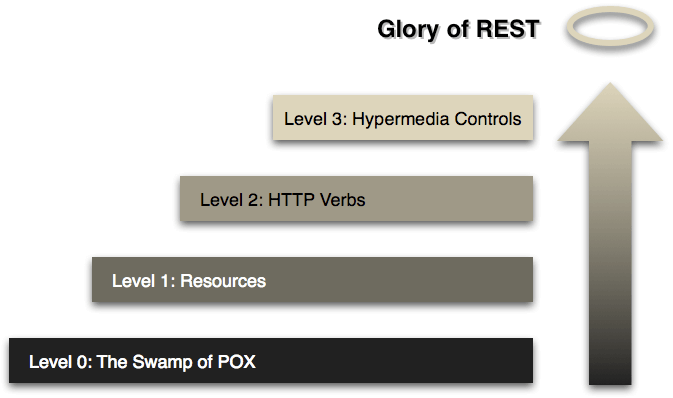

# Maturité d'une API REST - Richardson Maturity Model
*Temps de lecture* **5 minutes**

Too Long; Didn't Read;
> Pour évaluer si votre API est RESTful / HATEOAS, vous pouvez la placer sur le modèle de maturité de Richardson pour voir le niveau de votre API et les manquements éventuels
> 


Une API RESTful, i.e. qui respecte les [principes REST](https://restfulapi.net/rest-architectural-constraints/) (stateless, client-server,...), manipule des ressources, décrites par leurs URI, et peut exécuter des actions différentes selon le verbe HTTP utilisé.

Exemple non REST:
GET sur /createUser/ --> désigne une action et non pas ressource (createUser pour la ressource user) et le verbe GET n'est pas lié à l'action
POST /user/ est déjà plus en accord avec la nomenclature REST.


Je ne doute pas que cela vous parle. 
Mais un des grands principes, généralement négligé, est le fait de pouvoir naviguer de ressource en ressource à partir d'un point d'entrée dans l'API.

Comme sur un site web, une fois qu'on est dans arrivé sur le site, on peut naviguer sur ses différentes pages en suivant des liens, pas en allant modifier l'url à chaque fois que l'on veut voir une page différente.
C'est le principe de [HATEOAS](https://restfulapi.net/hateoas/).


Pour savoir où vous en êtes au niveau de votre API, si vous êtes bien RESTful ou si vous pouvez encore améliorer votre API, vous pouvez utiliser le [modèle de maturité de Richardson](https://martinfowler.com/articles/richardsonMaturityModel.html) pour voir où vous en êtes.
Il décrit 3 niveaux (le niveau 0 revient juste à ne pas essayer faire du REST) de maturité:


## Niveau 1 - Ressources
**URI: ok** - verbes HTTP: ko - HATEOAS: ko
Les APÏ à ce niveau désignent bien leurs ressources dans les URL. Il n'y a pas des verbes d'action dans l'url ou le détail de l'action à faire dans un doc XML (coucou SOAP).
Par contre il n'y a pas encore de discernement sur les verbes d'actions. Toute action page généralement via un POST, et le détail de l'action voulu (lecture des données, création, ...) est généralement dans la payload. On sort difficilement de ses habitudes SOAP 


## Niveau 2 - HTTP Verbs
**URI: ok - verbes HTTP: ok** - HATEOAS: ko
L'API présente correctement ses ressources (offer, order, inbound,...) via des URI, et supporte l'utilisation des verbes HTTP (GET, POST, PUT, PATCH) pour définir l'action à effectuer.
C'est le niveau le plus courant que l'on croise quand on parle d'API REST.
Mais au final ce genre d'API n'est pas encore RESTful


## Niveau 3 - Hypermedia Control
**URI: ok - verbes HTTP: ok - HATEOAS: ok**
Ici les ressources disposent de liens pour explorer facilement et/ou automatiquement des ressources liées.
Voici un exemple d'un GET sur http://example.com/articles, qui renvoi une liste d'article

```js
{
  "links": {
    "self": "http://example.com/articles",
    "next": "http://example.com/articles?page[offset]=2",
    "last": "http://example.com/articles?page[offset]=10"  },
  "data": [{
    "type": "articles",
    "id": "1",
    "attributes": {
      "title": "JSON:API paints my bikeshed!"    },
    "relationships": {
      "author": {
        "links": {
          "self": "http://example.com/articles/1/relationships/author",
          "related": "http://example.com/articles/1/author"        },
        "data": { "type": "people", "id": "9" }
      },
      "comments": {
        "links": {
          "self": "http://example.com/articles/1/relationships/comments",
          "related": "http://example.com/articles/1/comments"        },
        "data": [
          { "type": "comments", "id": "5" },
          { "type": "comments", "id": "12" }
        ]
      }
    },
    "links": {
      "self": "http://example.com/articles/1"    }
  },
          //other articles  ]
}
```
 
Grâce à ce retour, vous savez normalement comment récupérer l'article, son auteur ou la liste des commentaires.
Ce genre de fonctionnalité permet de grandement améliorer la [developer experience](https://blog.octo.com/reussir-la-developer-experience-de-son-api-web) d'une api.


## Quel format ?
Dernier point bonus, vous vous demandez peut être si il existe un format standard pour décrire ces liens ?
Oui et non, il est existe plusieurs standards actuellement, mais pour autant que je sache aucun ne s'est imposé comme unique standard. Libre donc à vous d'en suivre un ou de créer le votre.

Pour référence, l'exemple que je vous ai montré vient du standard [json:api](https://jsonapi.org/), mais vous pouvez aussi suivre le [JSON Hyper schema API](https://cubicweb-jsonschema.readthedocs.io/en/latest/http-api/schema-api/), [HAL (Hypertext Application Language)](https://stateless.co/hal_specification.html) ou encore [Siren](https://github.com/kevinswiber/siren) (et il y en a d'autres...)

J'espère que ça vous donnera des idées pour améliorer encore plus vos propres api, publiques ou non 😁