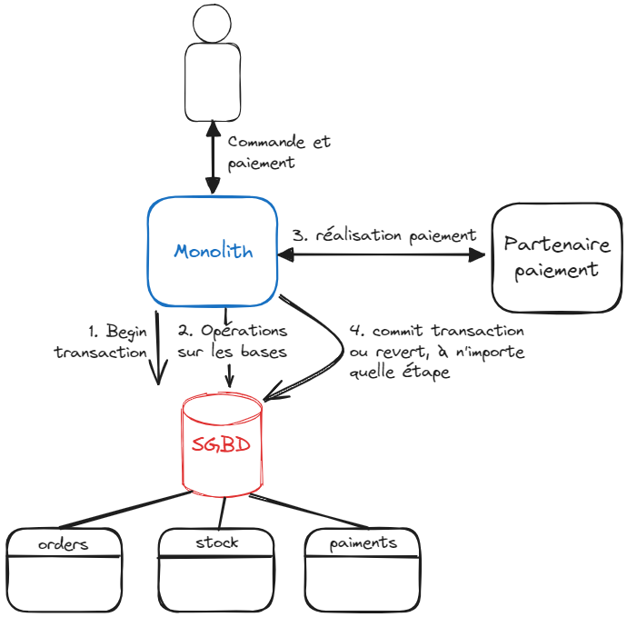
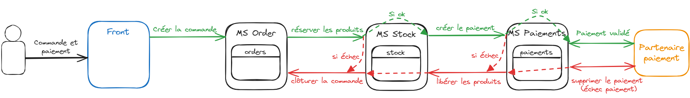

# Saga Pattern & Eventual Business Consistency
*Temps de lecture* **9 minutes**

Hello Craftmanship, aujourd'hui on va voir un pattern distribué, souvent utilisé pour gérer des transactions au travers de multiples micro-services. Ça sera également l'occasion de parler d'un concept import qu'est l'eventual consistency. 

[Lire l'article sur le repository des communications craft](http://tfs:8080/tfs/DefaultCollection/craftmanship/_git/coms-craft?path=%2Foauth2%2Foauth2.md&_a=preview)

Too Long; Didn't Read;
> La pattern saga permet de facilement gérer une opération qui doit arriver entièrement ou pas du tout (transaction), impliquant plusieurs micro-services. L'idée est que chaque action faite dans l'opération globale ait une "contre-action", permettant d'annuler les effets de l'opération initiale. Cela permet d'abandonner la transaction à n'importe quelle étape. Ce pattern repose sur la notion d'eventual consistency, où les données du systèmes peuvent être incohérente, mais finiront par arriver à un état stable, cohérent.

## Gestion des transactions
Vous le savez sûrement, une transaction permet de de rendre atomique - transformer en une seule opération - plusieurs opérations distinctes. L'objectif est que ces actions se fassent toutes ou qu'aucune n'aient lieu. L'objectif est d'éviter d'avoir un état inconsistant pouvant survenir lorsque les différentes actions prennent place l'une après l'autre.

Prenons un scénario basique d'achat sur CDiscount par exemple. On pourrait imaginer les opérations suivantes:
1. créer la commande
2. réserver les produits dans le stock
3. créer le paiement
4. valider le paiement
5. confirmer la commande

Ici, impossible de payer sans qu'une commande existe et que les produits soient réservés. A contrario, si jamais le paiement n'est pas validé, alors il faut annuler les réservations et, disons pour simplifier, supprimer la commande. 

Nous avons donc bien ici un scénario nécessitant une transaction, toutes les actions doivent avoir lieu, ou aucune. L'étape 5 consiste au final à commiter tous les nos changements pour valider l'existence de la commande.
Ne faire qu'une partie des actions nous laisserait dans un état ne respectant pas les règles du systèmes (impossible de réserver des produits pour une commande qui ne sera pas payée) et pourrait engendrer du gaspillage en bloquant dans l'entrepôt des produits réservés à tord.

Dans le cadre d'un monolithe, on pouvait généralement s'en sortir facilement en se reposant sur les transactions directement supporté par la base de données choisie. On démarre la transaction sur les tables commande, produit et paiement, on fait nos opérations, puis on commit si tout s'est bien passé, ou on rollback en cas de problème.
La complexité est gérée pas le SGBD.

Ici même le fait de faire appel à des services externes ne complique pas spécialement le processus, car c'est la dernière étape (pas de retour arrière à faire). Si ça n'avait été qu'une étape intermédiaire, alors il aurait fallu un moyen de gérer le rollback, en dehors de la transaction initiée dans la base de données.

C'est exactement ce problème qui est rencontré avec des architectures en microservice. Chaque microservice ou service externe est responsable d'une étape du traitement, qui doit être fait entièrement ou pas du tout.
Comment coordonner cela ? C'est justement là qu'intervient le pattern saga.

## Saga pattern
L'idée derrière ce pattern est extrêmement simple. Chaque microservice responsable de la réalisation d'une action doit proposer une anti-action. Un moyen d'annuler l'action initiale. Cela ne veut pas forcément dire supprimer, il peut rester des enregistrements, des logs, ... Mais l'action doit être annulée d'un point de vue métier. 

Dans le cas nominal, chaque microservice joue sa logique, et doit uniquement savoir quel endpoint appelé ensuite. Chacun n'est donc bien responsable que de son périmètre. Chaque étape peut facilement être testée en isolation.

Dans le cas d'une erreur, c'est la même logique de cascade Ainsi, si un problème intervient sur la création du paiement, celui ci peut jouer sa logique d'annulation, et juste appeler la route d'annulation du service précédent, ici pour libérer les réservations de produits. Le ms stock appellera ensuite le maillon suivant.
Cette logique sera répétée pour tous les maillons précédents dans la chaîne.

Ce pattern a l'avantage d'être relativement simple (les règles métier d'annulation peuvent être complexe, mais la logique du pattern non), de garder l'isolation des logiques métier dans chaque microservice, et donne la possibilité de tester chaque composant séparément, ou la chaîne dans son entièreté.

Autre point positif (notamment par rapport au Two-Phase commit que l'on verra après), les requêtes (action et anti-action) sont indépendantes. Normalement il n'y a pas besoin d'enregistrement ou de données techniques en plus pour gérer ces transactions en saga par rapport au fonctionnement en monolithe.

Côté points négatifs, on l'avait évoqué en parlant [granularité des microservices](http://tfs.cdbdx.biz:8080/tfs/DefaultCollection/craftmanship/_git/coms-craft?path=%2Fintegrators-disintegrators%2Fintegrators-disintegrators.md&_a=preview), cette façon de fonctionner est forcément plus lente qu'un scénario monolithique. Les calls http ou tout autre medium de discussion prennent du temps.
C'est inhérent à une architecture en microservices, et donc indépendant de l'utilisation du pattern saga, mais cela est toujours bien de le mentionner.

### Problème de l'incohérence des données

La grosse contrepartie de ce pattern est au final le temps. En effet, imaginons que lors de la dernière étape de paiement, on puisse attendre jusqu'à 15 minutes que le client termine son paiement avant de considérer l'étape échouée. Cela veut dire que pendant ce laps de temps, on a une transaction partiellement réalisée.
Cela entraîne une incohérence dans les données et des violations des règles métiers (ex: une commande dans le système est forcément payé --> non respecté pendant ce quart d'heure).

Dans certains scénarios, plus rapides ou moins contraints fonctionnellement, cette incohérence peut-être totalement acceptable. Dans d'autres cas, non. Cette tolérance sera un des point clés du choix de l'utilisation de ce pattern où d'un autre.

On peut faire l'analogie avec [les transactions ACID](https://fr.wikipedia.org/wiki/Propri%C3%A9t%C3%A9s_ACID) vs [l'eventual consistency](https://en.wikipedia.org/wiki/Eventual_consistency) en base de données, dont le choix dépends des propriétés que l'on souhaite privilégier

## Eventual (Business) Consistency
En effet, de par leur nature distribuée, l'utilisation de microservices 

Bases de données AP (théorème CAP) comme Cassandra ou CouchDB.

[eventual business consistency](https://tidyfirst.substack.com/p/eventual-business-consistency)

### Two-Phase Commit pattern
[Two-Phase commit](https://martinfowler.com/articles/patterns-of-distributed-systems/two-phase-commit.html)