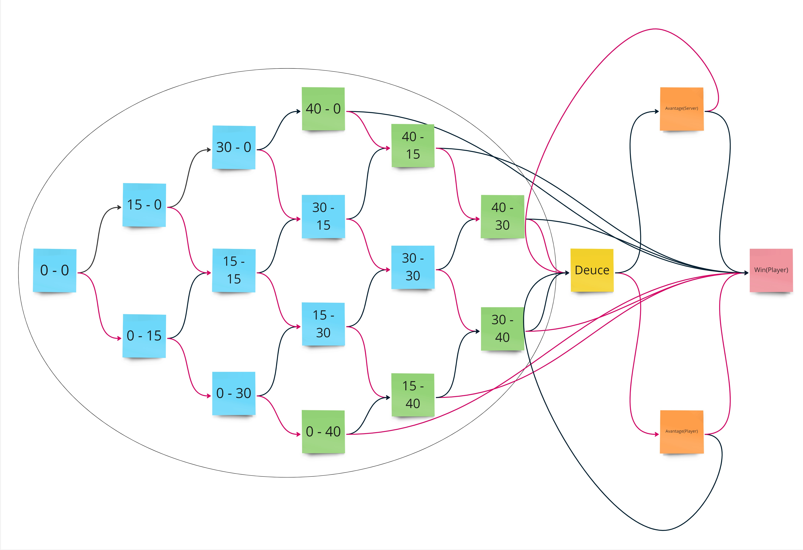
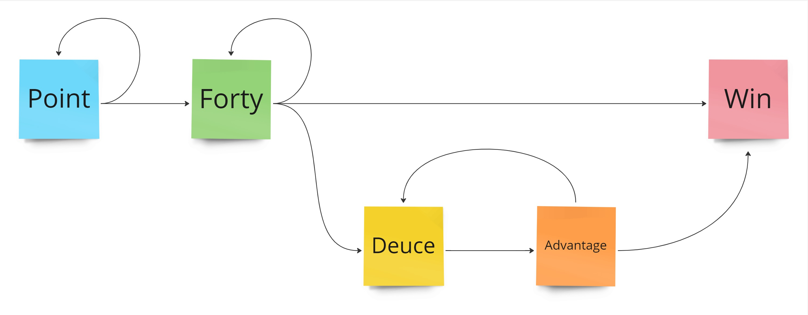

# State Pattern

Hello @Craftsmanship,

Cette semaine jouons au tennis avec le State Pattern.

> **TLDR**;  
> Le _State pattern_ est un patron de conception comportemental qui permet de modifier le comportement d’un objet lorsque son état interne change. 
> L’objet donne alors l’impression qu’il change de classe.

Notre use case sera de gérer l'affichage du score d'un jeu, en fonction du nombre de points marqués par chaque joueur.

## Règles du jeu

Pour les néophytes, les règles sont les suivantes :
> A game consists of a sequence of points played with the same player serving. 
> A game is won by the first player to have won at least four points in total and at least two points more than the opponent. 
> The running score of each game is described in a manner peculiar to tennis:   
> - scores from zero to three points are described as "love", "15", "30", and "40", respectively.   
> - If at least three points have been scored by each player, making the player's scores equal at 40 apiece, the score is not called out as "40–40", but rather as "deuce". 
> - If at least three points have been scored by each side and a player has one more point than his opponent, the score of the game is "advantage" for the player in the lead.  
>
> The score of a tennis game during play is always read with the serving player's score first. In tournament play, the chair umpire calls the point count (e.g., "15–love") after each point. At the end of a game, the chair umpire also announces the winner of the game and the overall score.

Une implémentation classique, utilisant des conditions pour déterminer le score à annoncer, pourrait être la suivante :

```csharp
public class TennisScore
{
    private readonly Server _server;
    private int _serverScore;
    private readonly Receiver _receiver;
    private int _receiverScore;

    public TennisScore(Server server, Receiver receiver)
    {
        _server = server;
        _receiver = receiver;
    }

    public void WonPoint(IPlayer player)
    {
        if (_server.Equals(player))
            _serverScore++;
        else if (_receiver.Equals(player))
            _receiverScore++;
        else
            throw new InvalidOperationException();
    }

    public string Score()
    {
        if (_serverScore >= (int)Point.Forty && _receiverScore >= (int)Point.Forty)
        {
            if (_serverScore.Equals(_receiverScore))
                return "Deuce";
            if (PointDifference() == 1)
                return $"Advantage {LeadingPlayer()}";
            return $"Game for {LeadingPlayer()}";
        }

        if (PointDifference() >= 2 && MaxScore() == 4)
            return $"Game for {LeadingPlayer()}";

        if (_serverScore == _receiverScore)
            return $"{_serverScore.ToPoint()}-All";

        return $"{_serverScore.ToPoint()}-{_receiverScore.ToPoint()}";
    }

    private int MaxScore() => Math.Max(_serverScore, _receiverScore);

    private int PointDifference() => Math.Abs(_serverScore - _receiverScore);

    private string LeadingPlayer() => _serverScore > _receiverScore ? _server.Name : _receiver.Name;
}
```


Même si ce code fonctionne, il souffre de plusieurs défauts :
- utilisations de **conditions complexes** (conditions imbriquées, dépendance dans l'ordre d'exécution) qui rendent le code difficile à lire (code smell : [Switch statements](https://refactoring.guru/smells/switch-statements))
- **open/closed principle** : à chaque nouvelle étape de la création de cette classe, nous devons modifier la majeure partie de la classe, ce qui augmente le risque d'effets de bord.

## Tennis et machine à état

Le score d'un jeu au tennis évolue selon une [machine à état fini](https://fr.wikipedia.org/wiki/Automate_fini) (FSM pour Finite State Machine) :
chaque score mène à un nouveau score parmi 2 scores possibles, en fonction du joueur marquant le point.



D'un point de vue code, nous pouvons regrouper certains de ces états ensemble, en fonction des transitions possibles vers les états suivants :



- *Point:* tout score pour lesquels aucun des joueurs n'a marqué 3 points
- *Forty:* tout score pour lesquels un seul joueur a marqué 3 points
- *Deuce:* les joueurs sont à égalité après avoir marqué un minimum de 3 points chacun
- *Advantage:* au moins 3 points marqués de chaque côté et un joueur a 1 point de plus que son adversaire
- *Win:* l'un des joueurs a au moins 4 points et au moins 2 points de plus que son adversaire

Implémentons donc un affichage de score d'un jeu basé sur cette machine à états.

## How to ?

La [recette pour appliquer le State Pattern](https://sourcemaking.com/design_patterns/state) est la suivante :
1. Identify an existing class, or create a new class, that will serve as the "state machine" from the client's perspective. That class is the "wrapper" class.
2. Create a State base class that replicates the methods of the state machine interface. Each method takes one additional parameter: an instance of the wrapper class. The State base class specifies any useful "default" behavior.
3. Create a State derived class for each domain state. These derived classes only override the methods they need to override.
4. The wrapper class maintains a "current" State object.
5. All client requests to the wrapper class are simply delegated to the current State object, and the wrapper object's this pointer is passed.
6. The State methods change the "current" state in the wrapper object as appropriate.


Les conditions changeant le comportement d'affichage du score portant toutes sur le score, ces propriétés définiront donc nos différents états.
Notre interface portera donc les 2 méthodes suivantes :

```csharp
public interface IState
{
    string Score();
    IState WonPoint(IPlayer winner);
}
```
Notre classe de contexte, portant les états, est notre classe responsable de l'affichage du score. 
Nous lui ajoutons donc un attribut représentant l'état de la manière suivante :

```csharp
public class TennisScore
{
    private IState _state;
    public TennisScore(Server server, Receiver receiver)
    {
        /* ... */
        _state = new Points();
    }

    public string Score()
    {
        /* ... */
        return _state.Score();
    }

    public void WonPoint(IPlayer player)
    {
        /* ... */
        _state = _state.WonPoint(player);
    }
}
```

Il est maintenant temps de créer nos différents états, en commençant par le score initial du jeu : 0-0.

```csharp
public record Points : IState
{
    private Points(Point serverScore, Point receiverScore)
    {
        _currentScore[typeof(Server)] =  serverScore;
        _currentScore[typeof(Receiver)] = receiverScore;
    }

    public Points() : this(Point.Love, Point.Love) { }

    public IState WonPoint(IPlayer winner)
    {
        return new Points();
    }

    public string Score()
    {
        return $"{Point.Love.ToString()}-All";
    }
}
```

À partir de ce moment, en utilisant le principe du [Strangler Fig Pattern](https://martinfowler.com/bliki/StranglerFigApplication.html) pour guider notre refactoring, nous pouvons implémenter nos différents états en nous laissant guider par les différentes conditions rencontrées dans la classe initiale, tout en gardant les tests verts au maximum.

L'implémentation finale est disponible [ici](./code/TennisGame/WithStatePattern).

## Quelques notes sur l'implémentation

- cette implémentation n'est pas une implémentation "by the book" : les états devraient modifier leur conteneur plutôt que de renvoyer l'état suivant. Cependant, ce type d'implémentation donne la possibilité de définir l'état de son choix au niveau du conteneur, ce qui est évité ici. L'implémentation "by the book" est à préférer lorsque des données relatives à chaque état doivent par exemple être persistées.
- l'état _Deuce_ pourrait être implémenté en tant que _Singleton_, car il ne porte aucun état interne propre
- ce pattern est à utiliser lorsque le fonctionnement d'une ou plusieurs méthodes diverge en fonction de conditions similaires, souvent basées sur la valeur d'un énumérateur. Dans ce cas, le refactoring [Replace type code with State / Strategy](https://refactoring.guru/replace-type-code-with-state-strategy) s'applique facilement.
- chaque état doit porter les données qui lui sont propres. De cette manière, la classe contenant les états contiendra moins de champs nullables, remplis ou non en fonction de l'avancement de son cycle de vie. Les méthodes de transition deviennent également plus claires et explicites sur leur fonctionnement ([Intention revealing interfaces](https://khalilstemmler.com/articles/typescript-domain-driven-design/intention-revealing-interfaces/))

Happy refactoring ;)