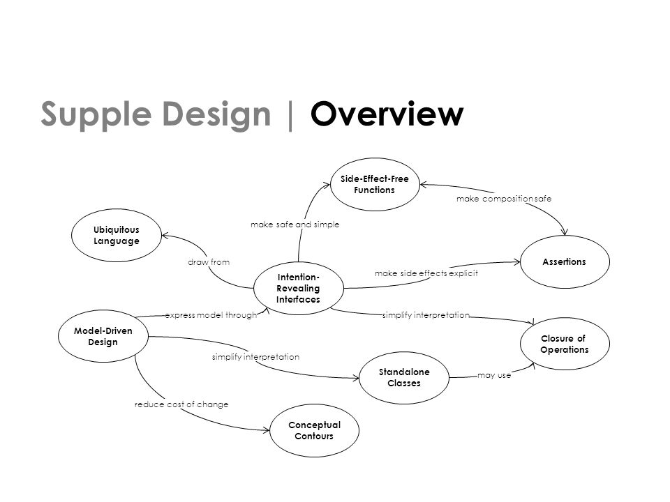

# Value Objects

Hello @craftmanship,

Aujourd'hui, un peu de *Domain Driven Design* avec le pattern tactique *Value Objects*   
...  
et beaucoup d'exemples de code, car nous allons voir comment les faire émerger par des refactorings.


## Définition

> A **Value Object** is an object that represents **a concept from your problem Domain**. 
> It is important in DDD that Value Objects **support and enrich Ubiquitous Language** of your Domain.
> They are not just primitives that represent some values - they are domain citizens that **model behaviour** of your application.

Bonne nouvelle, puisque c'est un concept de notre domaine métier, nous devons en trouver des traces dans le code : prenons un exemple !

Nous devons calculer / afficher des prix dans différentes devises sur le récapitulatif du panier d'un site de vente en ligne. 
Pour cela nous avons à disposition 2 services : 
- un service de conversion de devise faisant appel au domaine de la finance
- un service de calcul de prix qui nous permettra d'afficher par exemple le total du panier (somme des prix des produits)

```csharp
public interface ICurrencyConverter
{
    double Convert(double amount, Currency from, Currency to);
}

public static class PriceCalculator
{
    public static double Plus(double amount, Currency currency, double amount2) => amount + amount2;
    public static double Times(double amount, Currency currency, int value) => amount * value;
    public static double Divide(double amount, Currency currency, int value) => amount / value;
}
```

## Primitive obsession

Le premier signe (ou code smell) signalant le besoin d'un *Value Object* réside nos déclarations de méthodes : 
toutes manipulent un montant et une devise, les données de notre prix, sous la forme de [types primitifs](https://refactoring.guru/smells/primitive-obsession).
La conséquence est une perte de sens dans l'utilisation de ces méthodes, puisque dans leur utilisation, l'appelant se retrouve responsable de restituer la devise liée au montant. 
Nous pouvons donc créer notre classe `Price` en utilisant le refactoring [Introduce parameter object](https://refactoring.guru/introduce-parameter-object).

```csharp
public class Price
{
    public double Amount { get; init; }
    public Currency Currency { get; init; }

    public Price(double amount, Currency currency)
    {
        Amount = amount;
        Currency = currency;
    }
}
```

Une fois ce premier refactoring effectué, nous obtenons les déclarations de méthode suivantes :
```csharp
public interface ICurrencyConverter
{
    Price Convert(Price price, Currency to);
}

public static class PriceCalculator
{
    public static Price Add(Price price, double amount2) => new Price(price.Amount + amount2, price.Currency);
    public static Price Times(Price price, int value) => new Price(price.Amount * value, price.Currency);
    public static Price Divide(Price price, int value) => new Price(price.Amount / value, price.Currency);
}
```
Nous avons modélisé les données, il nous manque maintenant les comportements.

## Feature envy

Le service PriceCalculator n'a pas de données propres et ses méthodes accèdent aux données du prix. Nous sommes en présence du code smell [feature envy](https://refactoring.guru/smells/feature-envy).
Nous allons donc ajouter les comportements attendus à notre value object `Price`.
Pour la multiplication, les spécifications sont plutôt simples :

```csharp
public class PriceShould
{
    [Fact]
    public void be_multiplied_by_a_number()
    {
        var price = new Price(10, Currency.EUR);
        var twice = price.Times(2);
        twice.Amount.Should().Be(20);
    }
}
```

et le code correspondant également :

```csharp
public class Price
{
    public double Amount { get; }
    public Currency Currency { get; }

    public Price(double amount, Currency currency)
    {
        Amount = amount;
        Currency = currency;
    }
    
    public Price Times(double value) => new Price (Amount * value, Currency);
}
```

## Immuabilité et égalité

> An object that represents a descriptive aspect of the domain with no conceptual identity is called a Value Object.
> Value Objects are instantiated to represent elements of the design that we care about only for what they are, not who or which they are.  
> *- Eric Evans*

Dans cette définition se cachent 2 propriétés des *Value Objects* :
- ils doivent être immuables, ce qui garantira qu'il ne seront jamais altérés, provoquant ainsi des effet de bord inattendus (qui n'a jamais manipulé de date en javascript ou php ?),
- l'égalité entre 2 `Value Object` n'est pas définie par une identité, mais par les valeurs de leurs propriétés.

L'immuabilité est garantie par le retour d'une nouvelle instance de notre classe, modifions notre spécification pour garantir l'égalité :

```csharp
public class PriceShould
{
    [Fact]
    public void be_multiplied_by_a_number()
    {
        var price = new Price(10, Currency.EUR);
        var twice = price.Times(2);
        twice.Amount.Should().Be(new Price(20, Currency.EUR));
    }
}
```
et implémentons `IEquatable<Price>` grâce à notre IDE :

```csharp
public sealed class Price: IEquatable<Price>
{
    public Price(double amount, Currency currency)
    {
        Amount = amount;
        Currency = currency;
    }

    public double Amount { get; }
    public Currency Currency { get; }

    public Price Times(double value) => new Price(Amount * value, Currency);

    public bool Equals(Price? other)
    {
        if (ReferenceEquals(null, other)) return false;
        if (ReferenceEquals(this, other)) return true;
        return Amount.Equals(other.Amount) && Currency == other.Currency;
    }

    public override bool Equals(object? obj)
    {
        if (ReferenceEquals(null, obj)) return false;
        if (ReferenceEquals(this, obj)) return true;
        if (obj.GetType() != this.GetType()) return false;
        return Equals((Price)obj);
    }

    public override int GetHashCode()
    {
        return HashCode.Combine(Amount, (int)Currency);
    }

    public static bool operator ==(Price? left, Price? right)
    {
        return Equals(left, right);
    }

    public static bool operator !=(Price? left, Price? right)
    {
        return !Equals(left, right);
    }
}
```

## Invariants

De la même manière, nous implémentons la division et l'addition :

```csharp
public class PriceShould
{
    [Fact]
    public void be_divided()
    {
        var price = new Price(10, Currency.EUR);
        var half = price.DivideBy(2);
        half.Should().Be(new Price(5, Currency.EUR));
    }

    [Fact]
    public void be_added()
    {
        var price = new Price(10, Currency.EUR);
        var sum = price.Plus(new Price(10, Currency.EUR));
        sum.Should().Be(new Price(20, Currency.EUR));
    }
}
public sealed class Price: IEquatable<Price>
{
    public Price(double amount, Currency currency)
    {
        Amount = amount;
        Currency = currency;
    }

    public double Amount { get; }
    public Currency Currency { get; }

    public Price Times(double value) => new Price(Amount * value, Currency);
    public Price DivideBy(double divisor) => new Price(Amount / divisor, Currency);
    public Price Plus(Price price) => new Price(Amount + price.Amount, Currency);
    /* .. */
}
```

> An Invariant business rule is a rule that will always hold, no matter what we try to do in our system.

Un invariant est une règle métier qui se doit d'être respectée dans n'importe quelle situation.
Dans le cas de notre addition, une règle se présente à nous : on peut ajouter 2 prix uniquement s'ils ont la même devise.


Pour garantir notre invariant, nous allons utiliser un Guard (aka Assertion) de type précondition, c'est-à-dire valider les données entrantes avant toute exécution de code :

```csharp
public class PriceShould
{   /* ... */ 
    [Fact]
    public void be_added_to_price_with_same_currency()
    {
        var price = new Price(10, Currency.EUR);
        var sum = price.Plus(new Price(10, Currency.EUR));
        sum.Should().Be(new Price(20, Currency.EUR));
    }

    [Fact]
    public void not_be_added_to_price_with_different_currency()
    {
        var price = new Price(10, Currency.EUR);
        var sum = () => price.Plus(new Price(10, Currency.USD));
        sum.Should().Throw<ArgumentException>();
    }
}

public sealed class Price: IEquatable<Price>
{
    /* ... */
    public Price Plus(Price price)
    {
        if (price.Currency != Currency) throw new ArgumentException("Can not add prices with different currencies");
        return new Price(Amount + price.Amount, Currency);
    }
    /* ... */
}
```

L'addition est maintenant valide dans tous les cas, sans que ce soit à l'utilisateur de notre classe d'en porter la responsabilité. 
Notre contrat d'API, c'est-à-dire l'ensemble des méthodes publiques de notre *Value Object*, est donc renforcé.
Existe-t-il d'autres invariants qui ne seraient pas encore explicités ?
Un prix négatif n'a par exemple aucune de raison d'exister. De la même manière, un prix dont le montant serait infini serait problématique 
(difficile d'appliquer une réduction dans ce cas).
Nous pouvons donc borner l'utilisation de notre value object dès la construction.

```csharp
public class PriceShould
{
    [Fact]
    public void have_positive_amount()
    {
        var buildingNegativePrice = () => new Price(-1, Currency.EUR);
        buildingNegativePrice.Should().Throw<ArgumentException>().WithMessage("Price amount must not be a negative value");
    }

    [Fact]
    public void have_finite_amount()
    {
        var buildingInfinitePrice = () => new Price(double.PositiveInfinity, Currency.EUR);
        buildingInfinitePrice.Should().Throw<ArgumentException>().WithMessage("Price amount must have a finite value");
    }
}

public sealed class Price: IEquatable<Price>
{
    /* ... */
    public Price(double amount, Currency currency)
    {
        if (amount < 0) throw new ArgumentException("Price amount must not be a negative value");
        if (double.IsPositiveInfinity(amount)) throw new ArgumentException("Price amount must have a finite value");

        Amount = amount;
        Currency = currency;
    }
    /* ... */
}
```

Lever des exceptions dans un constructeur peut avoir [un impact au niveau de l'utilisation mémoire](https://learn.microsoft.com/en-us/cpp/mfc/exceptions-exceptions-in-constructors?view=msvc-170), 
nous pouvons améliorer ce code en utilisant une [Factory method](https://refactoring.guru/design-patterns/factory-method).
Le constructeur passera alors en visibilité `private` pour bloquer la création d'un prix invalide.

```csharp
using static Pricing.Domain.Price;

public class PriceShould
{
    [Fact]
    public void be_added_to_price_with_same_currency()
    {
        APriceOf(10, EUR)
            .Plus(APriceOf(10, EUR))
            .Should()
                .Be(APriceOf(20, EUR));
    }
}

public sealed class Price: IEquatable<Price>
{
    /* ... */
    private Price(double amount, Currency currency)
    {
        Amount = amount;
        Currency = currency;
    }

    public static Price APriceOf(double amount, Currency currency)
    {
        if (amount < 0) throw new ArgumentException("Price amount must not be a negative value");
        if (double.IsPositiveInfinity(amount)) throw new ArgumentException("Price amount must have a finite value");

        return new Price(amount, currency);
    }
    /* ... */
}
```

## Supple design

> Supple design is the complement to deep modeling. Once you've dug out implicit concepts and made them explicit,
> you have the raw material. Through the iterative cycle, you hammer that material into a useful shape,
> cultivating a model that simply and clearly captures the key concerns,
> and shaping a design that allows a client developer to really put that model to work.

Dans le [Blue Book](https://www.eyrolles.com/Informatique/Livre/domain-driven-design-9780321125217/), 
Eric Evans décrit les principes permettant un design évolutif tout au long du cycle de vie de nos applications :



Dans notre implémentation finale, le principe d'*Intention-Revealing Interfaces* a été respecté grace au nommage des méthodes
(l'approche du code en TDD favorise ce principe, puisque nous nous plaçons dans un premier temps en tant qu'utilisateur du code qui sera écrit).
Nous avons utilisé des *Assertions* (ou Guards) pour garantir les invariants et utilisé l'immuabilité pour éviter les effets de bord.

Qu'en est-il des autres principes ? Ce sera pour une prochaine fois, cette com est déjà beaucoup trop longue ;)

## Quelques ressources utiles pour terminer

- Lutter contre les [modélisations anémiques](https://martinfowler.com/bliki/AnemicDomainModel.html) avec le [Tell don't ask principle](https://martinfowler.com/bliki/TellDontAsk.html) 
- Pourquoi notre `value object` n'est pas un `record` ? [la question est vite répondue](https://enterprisecraftsmanship.com/posts/csharp-records-value-objects/)
- Une liste de [refactorings pour améliorer la modélisation du domaine métier](https://hschwentner.io/domain-driven-refactorings/) (en cours de création)
- Cet [article](http://tfs.cdbdx.biz:8080/tfs/DefaultCollection/craftmanship/_git/coms-craft?path=%2Fvalue-objects%2Fvalue-object.md&_a=preview) ainsi que [les exemples de code utilisés](http://tfs.cdbdx.biz:8080/tfs/DefaultCollection/craftmanship/_git/coms-craft?path=%2Fvalue-objects%2Fcode), le tout dans un repo git ;)
- Pour s'exercer : le [tell don't ask kata](https://github.com/racingDeveloper/tell-dont-ask-kata) et le [workshop Xtrem TDD](https://github.com/les-tontons-crafters/xtrem-tdd-money-kata)