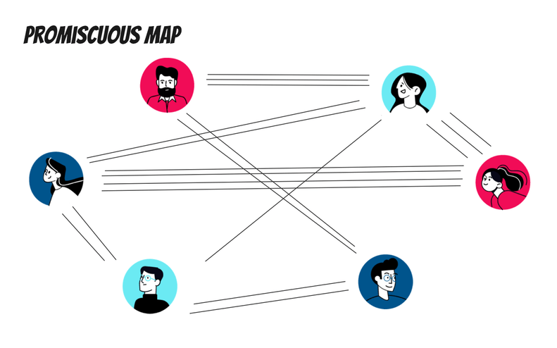
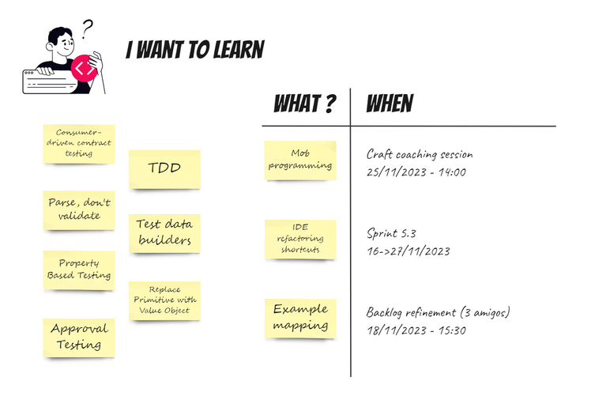
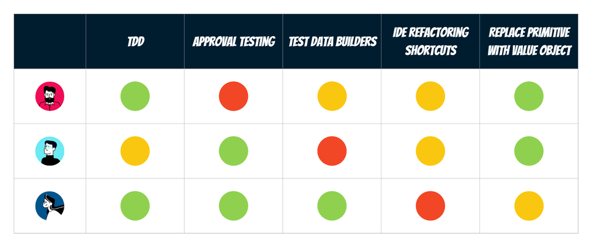
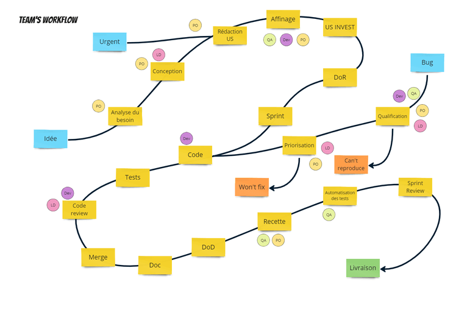
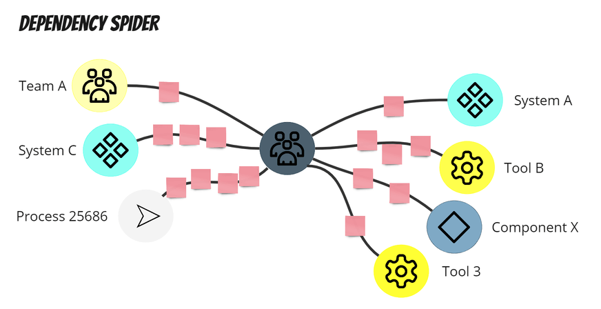
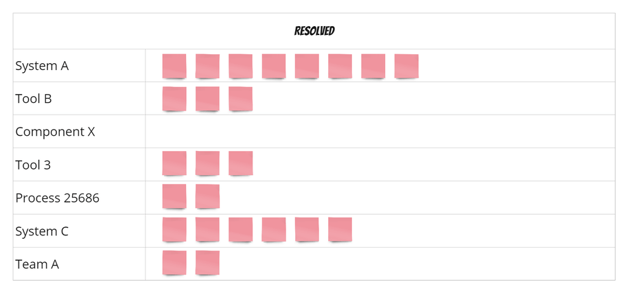

# 
*Temps de lecture* **4 minutes**

Too Long; Didn't Read;
>

Cette semaine, quelques exemples de visualisations pour faciliter la communication au sein de votre équipe, la diffusion des idées, les prises de décisions ... pour les développeurs, mais pas seulement 🙂.
 
## Promiscuous map : pour améliorer son travail en pair (programming, review ...)
 
Vous vous lancez dans des pratiques d'équipe, comme le pair programming ou la pair review pour homogénéiser vos pratiques de code ? Ou vous avez juste défini le nombre de reviewers nécessaire pour valider vos PR à 2 développeurs.
Êtes-vous sûrs de ne pas recréer des silos ?
 
 
 
Chaque fois que vous faites équipe avec quelqu'un, tracez une ligne entre vous et l'autre personne. Après quelques jours, des tendances apparaîtront probablement.
 
Régulièrement, analysez les résultats :
* À quelle fréquence pratiquons-nous réellement ?
* Qui s'associe à qui ?
* Voulons-nous briser certains schémas, en faire apparaître de nouveaux ?

## I want to learn : un backlog d'amélioration continue individuel
 
Chaque fois que vous constatez un manque de connaissance sur un outil, une méthodologie, une pratique ou que vous souhaitez vous améliorer, ajoutez le à votre backlog personnel.

Quand l'occasion se présente d'appliquer un sujet ou de participer à sa mise en place, prévoyez-le : écrivez quand et dans quel contexte.

Le jour J, n'oubliez pas de partager l'information avec vos collègues, ils pourraient vouloir vous accompagner.
 

## Skills matrix
 
Pour vous donner des idées et enrichir votre liste de compétences à acquérir, réunissez vos talents d'équipe dans une matrice de compétences.

Une matrice de compétences est une grille qui illustre clairement les aptitudes détenues par les individus au sein d'une équipe.

Elle vous aidera à répondre à ces questions :
* Quelles compétences sont déjà présentes dans l'équipe ?
* Quelles compétences possédez-vous qui pourraient ne pas être pertinentes par rapport à l'objectif de l'équipe ?
* Quelles compétences aimeriez-vous acquérir ou apprendre de certains des autres membres de l'équipe ?

 Une fois que vous avez les réponses à ces questions, vous pouvez :
* Définir comment partager les connaissances des gens
* Identifier quelles sont les compétences manquantes nécessaires pour atteindre l'objectif de l'équipe
* Suivre la montée en compétences de l'équipe
 

## Team's workflow
 
Comment une idée part en production ? Toute l'équipe avance-t-elle de la même manière ?
L'objectif de cette visualisation est de partager le flow qui amène jusqu'à la livraison.

Tracez votre chemin, symbolisez les différentes étapes de réalisation, identifiez les rôles nécessaires, mettez en valeur les goulots d'étranglement ... et prenez les actions pour améliorer l'existant à vos besoins.
 
 
 ## 🕷️ Dependency spider : collaborer avec le monde extérieur🕷️
 
Préparez 🎃 Halloween 🎃 en dessinant une araignée avec votre équipe au milieu.

Au bout de chaque patte, symbolisez les sources de dépendances qui peuvent bloquer votre progression ou vous obliger à attendre. Ces sources peuvent être liées à une équipe, un process, un outil ...

A chaque fois qu'un blocage se produit, ajoutez une note décrivant comment vous êtes actuellement bloqués ainsi que le temps écoulé sur les pattes de l'araignée.

Une fois le blocage résolu, déplacez le ticket vers une zone « Résolu »

Pendant une rétrospective, récupérez les post-its des sources les plus courantes et analysez ce que vous pouvez faire pour réduire les temps d'attente et/ou la fréquence. Prenez les actions en conséquence.
(vous pouvez en profiter pour convier les membres d'autres équipes pour l'occasion).

À vous de jouer

Ces visualisations ne sont que des exemples de mise en œuvre. L'important est de faciliter le partage des informations.
Si vous les trouvez utiles, essayez-les, adaptez-les, faites les évoluer selon vos besoins, et, pourquoi pas, partagez-les à la suite de ce post 😉